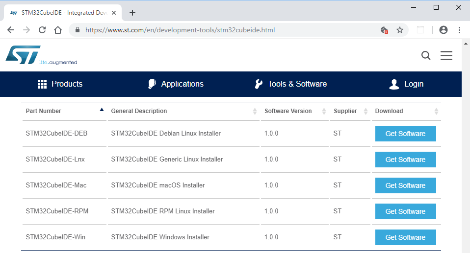
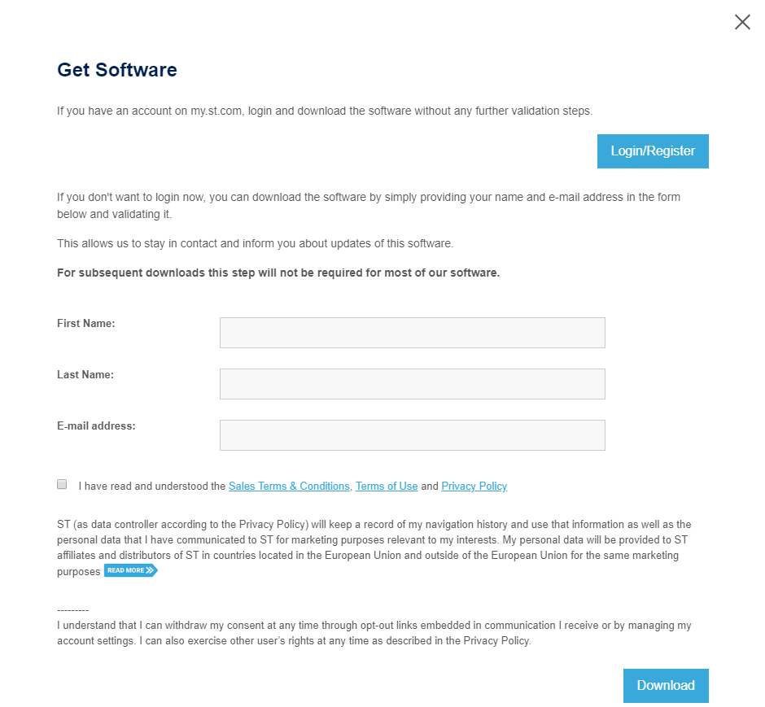
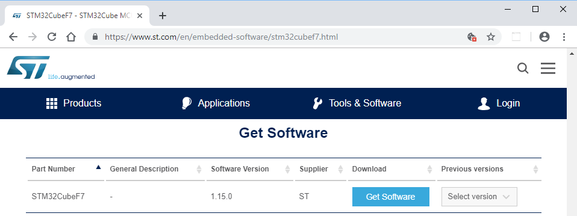
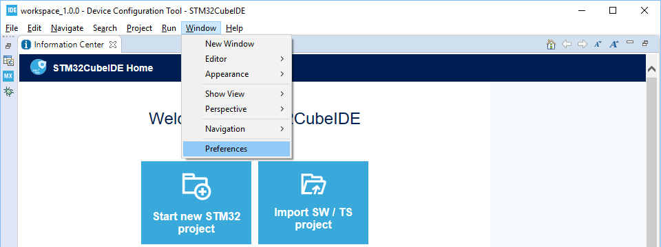
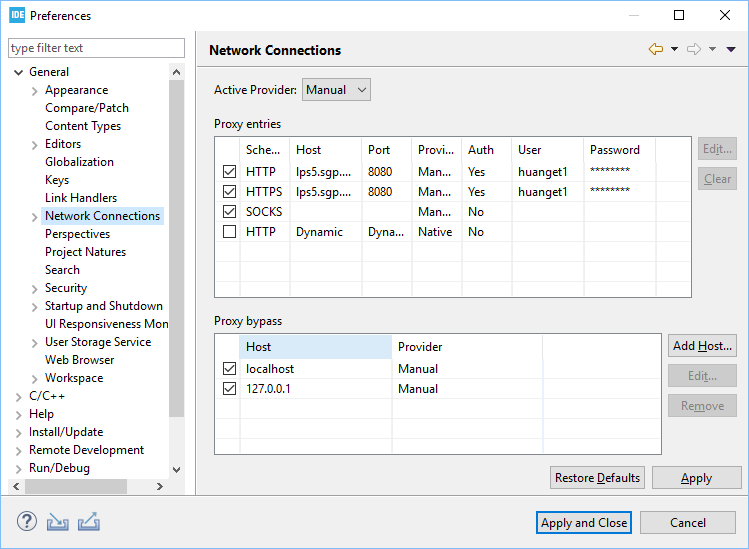
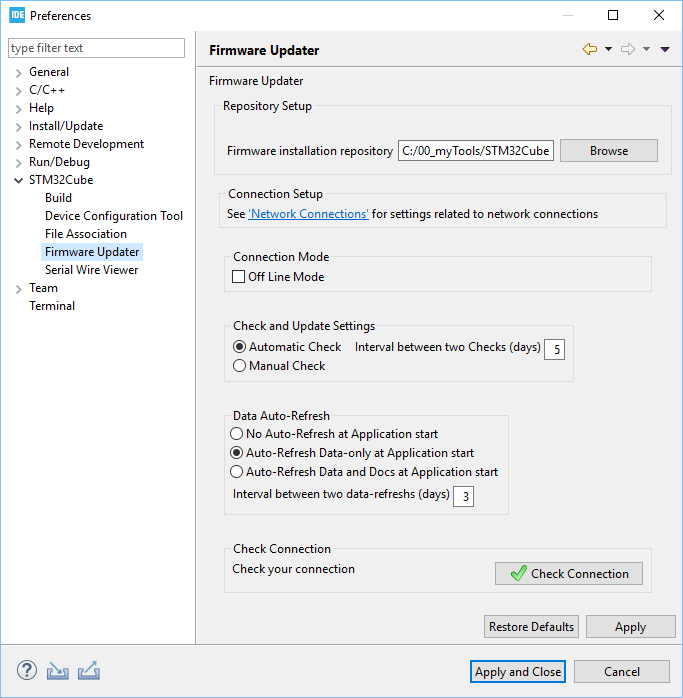

# Prerequisite
1. Download and install STM32CubeIDE from the following link:

   https://www.st.com/en/development-tools/stm32cubeide.html

   
   
   * Please note that user login is required to download STM32 software as shown below. Please register first if you do not have the account.
    
     
   * As described in [STM32CubeIDE installation guide UM2563](https://www.st.com/resource/en/user_manual/dm00603964.pdf), **only 64-bit OS** versions are supported.

2. Download and install STM32Programmer from the following link:

   https://www.st.com/en/development-tools/stm32cubeprog.html

   

   * Login/register is required.

3. Download STM32CubeF7 MCU package from the following link:

   https://www.st.com/en/embedded-software/stm32cubef7.html

   

   * Login/register is required.

4. Setting up network connection for STM32CubeIDE is necessary if your laptop is managed by the proxy of your company. 

   * Open STM32CubeIDE
   
   * Use default workspace
   
     
   
   * Suggest to choose "NO" for the following dialogs:

     .cproject file extension:
     
     
     
     .project file extension:
     
     
   
   * Window --> Preferences (as shown below)
     
   * General --> Network Connection (as shown below)
     
   
   * Check network connection by clicking "Check Connection" button in STM32Cube --> Firmware Updater (as shown below)
   
     

5. To read README.md offline downloaded from Github, please download and install any markdown viewer/editor such as [Typora](https://typora.io/).