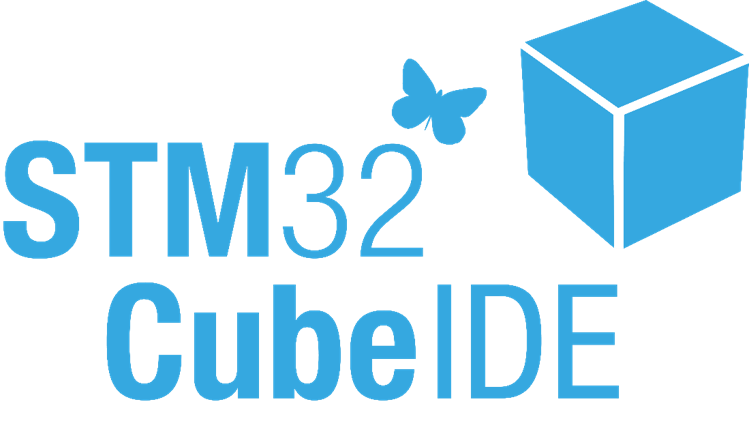

# STM32CubeIDE Workshop

Date: 2019.05.22 (WED)

Time: 09:30 - 17:00

Venue: 台北市內湖區基湖路10巷50號2樓[[Google map]](https://goo.gl/maps/c8vGBHJDmh5RcEpR7)

Development Board: [32F746GDISCOVERY](https://www.st.com/en/evaluation-tools/32f746gdiscovery.html)

### [Prerequisite](Prerequisite.md)
### [事前準備繁體中文版](Prerequisite_zh-TW.md)

## Hands-on List
1. [Start a New Project](hands-on/01_Start/README.md)
2. [Import a Makefile-base Project](hands-on/02_stm32_hp141_lcd/README.md)
3. [Using Printf](hands-on/03_printf/README.md)
4. [Using Fault Analyzer](hands-on/04_hardfault/README.md)
5. [X-CUBE-DSPDEMO](hands-on/05_X-CUBE-DSPDEMO/README.md)
6. [Generating CRC Checksum](hands-on/06_F746-DISCO-CRC/README.md)
7. [Running ISR in ICTM](hands-on/07_ISR_in_ICTM/README.md)
8. [Using External Loader](hands-on/08_QSPI_PreInitConfig/README.md)
9. [BOOT+APP](hands-on/09_BOOT-APP/README.md)
