# Hands-on: Start New STM32 Project

1. After running STM32CubeIDE, STM32CubeIDE Launcher appears as shown below:
   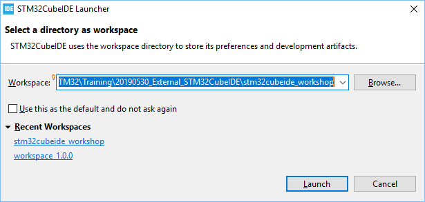

   Please select a location to store the workspace or simply use the default workspace for convenient. After pressing "Launch" button, the following will appear:
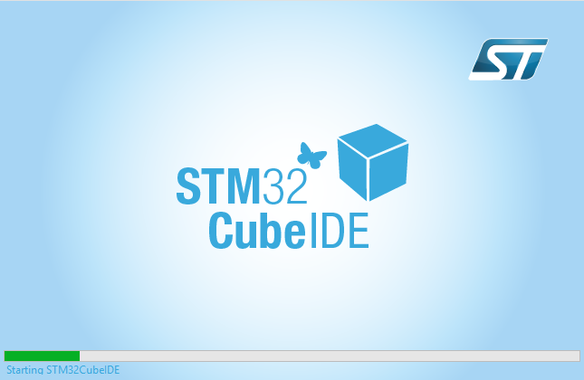
   
   Suggest to select "NO" for the following override setting for file association for **.cproject** file if you have some other Eclipse-base IDE installed in your system:  
   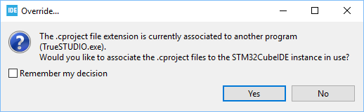
   
   Suggest to select "NO" for the following override setting for file association for **.project** file if you have some other Eclipse-base IDE installed in your system:  
   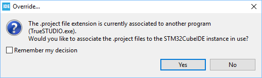
   
   
   
2. After getting into "Information Center", please press "Start new STM32 project" button on the left:
   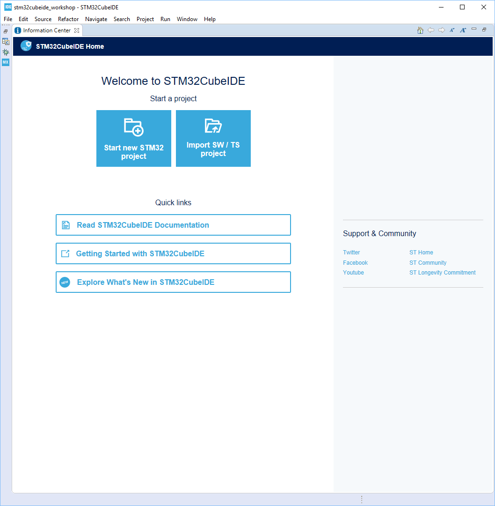
   The following will pop up and may take some time:
   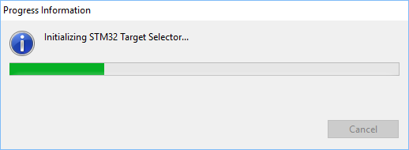
   
   
   
3. Select "Board Selector" and type "34F746" in "Part Number Search" to quickly sort out the board we want. Click 32F746DISCOVERY in Board List and then press "Next" button:  
   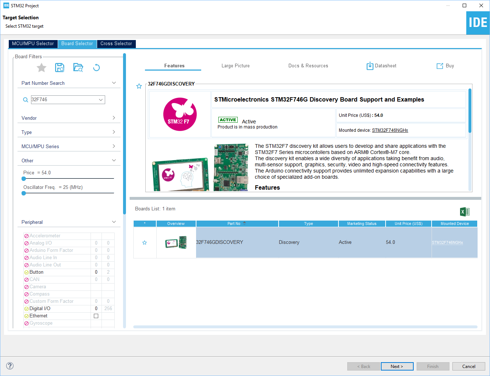
   Assign Project Name and suggest to keep "Use default location" checked, then press "Finish" button:  
   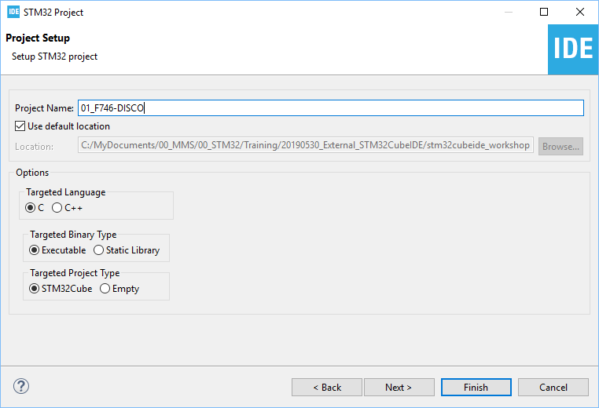

   Press "NO" for the following dialog:  
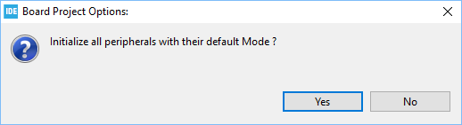

   Press "YES" for the following dialog and suggest to check "Remember my decision":  
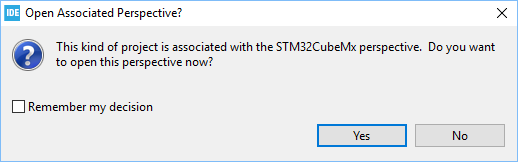

   The initialization may take some time:  
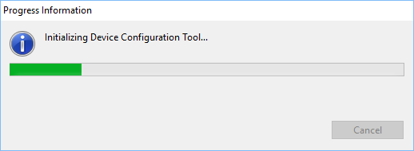

   The Project Creation may also take some time:  
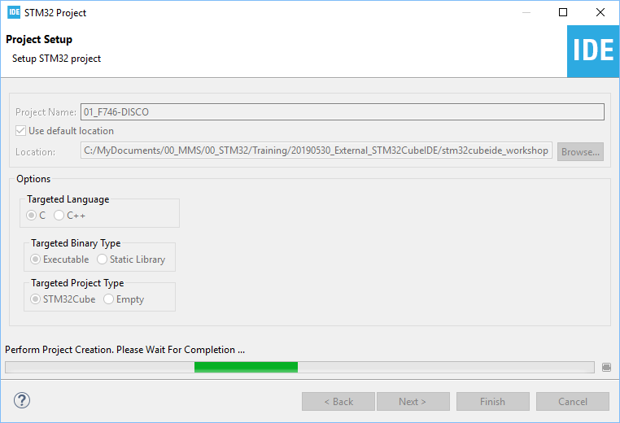
   
   
   
4. In IOC editor, please search for PI1 pin and set it to GPIO_Output
   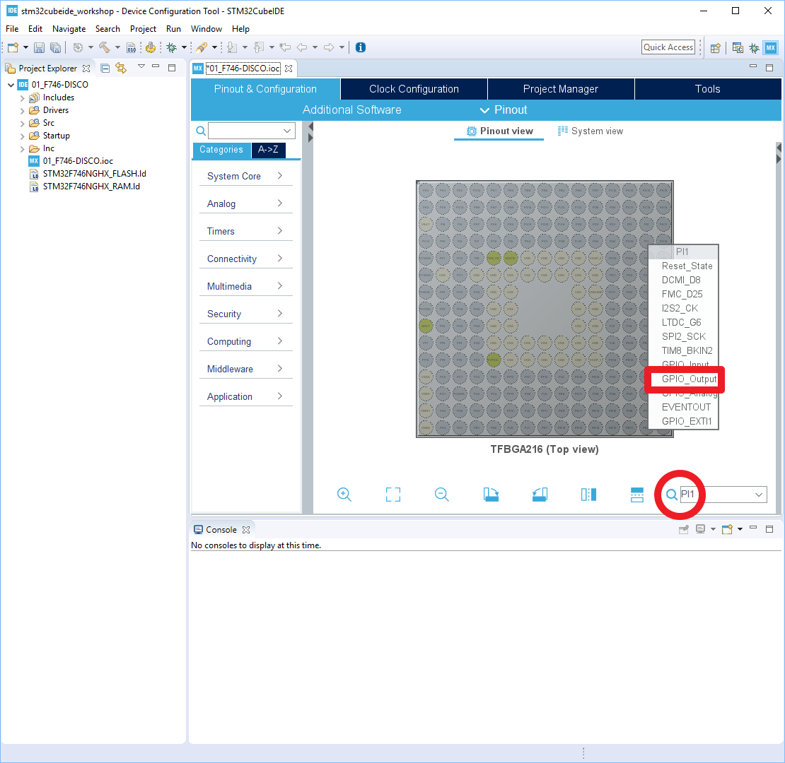
   
   
   
5. Add the following code to toggle LED LD1 (controlled by PI1) inside USER CODE Block 3 inside main():
   
   ```c
          /* USER CODE BEGIN 3 */
          HAL_Delay(500);
          HAL_GPIO_TogglePin(GPIOI, GPIO_PIN_1);
        }
        /* USER CODE END 3 */
   ```
   
   
   
6. Press the following button to generate code:  
   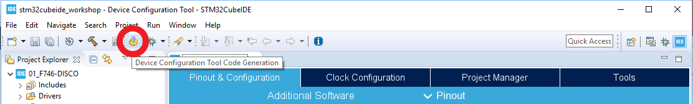
   
   
   
7. Right click on project icon and then select "Build Project":  
   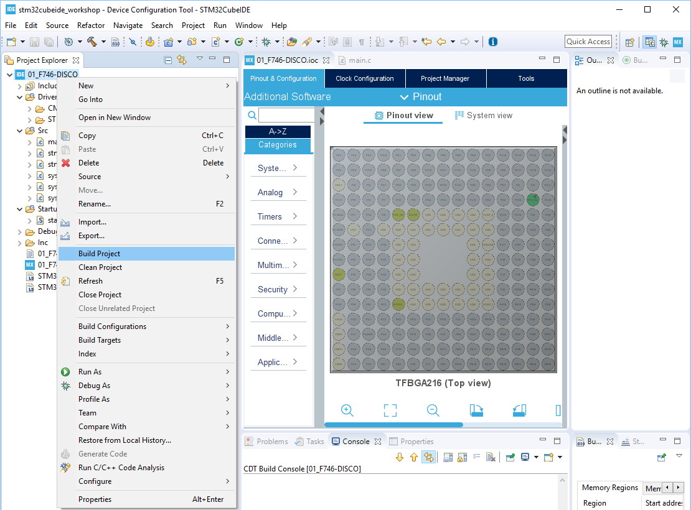
   
   
   
8. Start to run debug

   * Right click on project icon and then select "Debug As --> 2 STM32 MCU C/C++ Application":
     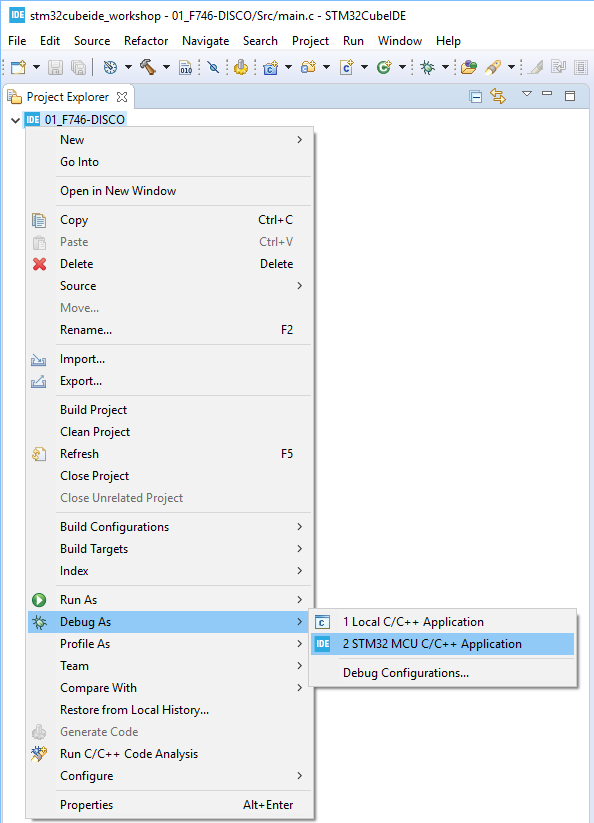

   * Press "OK" in this dialog:

     

   * Press "Switch" button and suggest to check "Remember my decision":  
     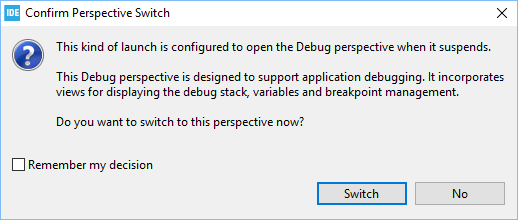
     
   * The following error may appear when ST-LINK FW of your board is not new enough.  
     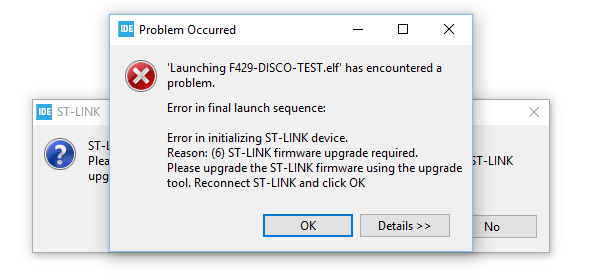
     
      1. If the error occurs, please press "OK" button in the picture above, and then press "OK" button in the picture below:  
     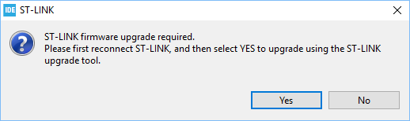
       2. Press "Open in update mode" button in the picture below:  

       3. Press "Update" button in the picture below:  
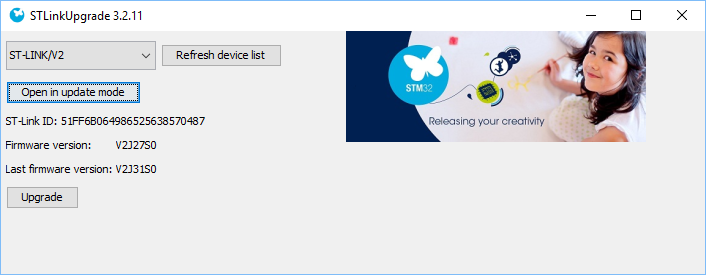
       4. ST-LINK upgrade starts after pressing "Update" button:  
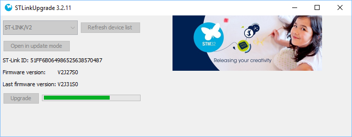
       5. ST-LINK upgrade completes.  
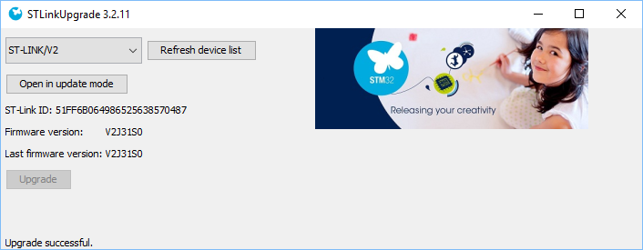
     
     
   
9. After switching to debug perspective, press "Resume" button to run your code:  
   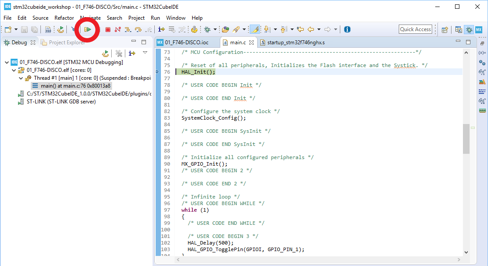


## Some More Features Worth Trying

1. MCU Post build outputs: HEX/BIN
2. Editor: Auto-complete
3. Editor: Macro expansion
4. Editor: Code navigation

