# Hands-on: stm32_hp141_lcd

## Introduction

This hands-on is originally from the Github repository: **[stm32_hp141_lcd](https://github.com/schnommus/stm32_hp141_lcd)**. It is designed to run on an STM32F746G Discovery board used to upgrade the CRT of an HP141T spectrum analyzer. [Youtube is available](https://youtu.be/CwwRvqHGyts). 

This hands-on is cloned from this interesting project and STM32Cube_FW_F7_V1.5.0 folder with only necessary files is put into this hands-on folder. The project could be compiled without error and generates **<u>out.elf</u>** as shown below:

Please use STM32CubeProgrammer to flash out.elf into STM32F746-DISCO:

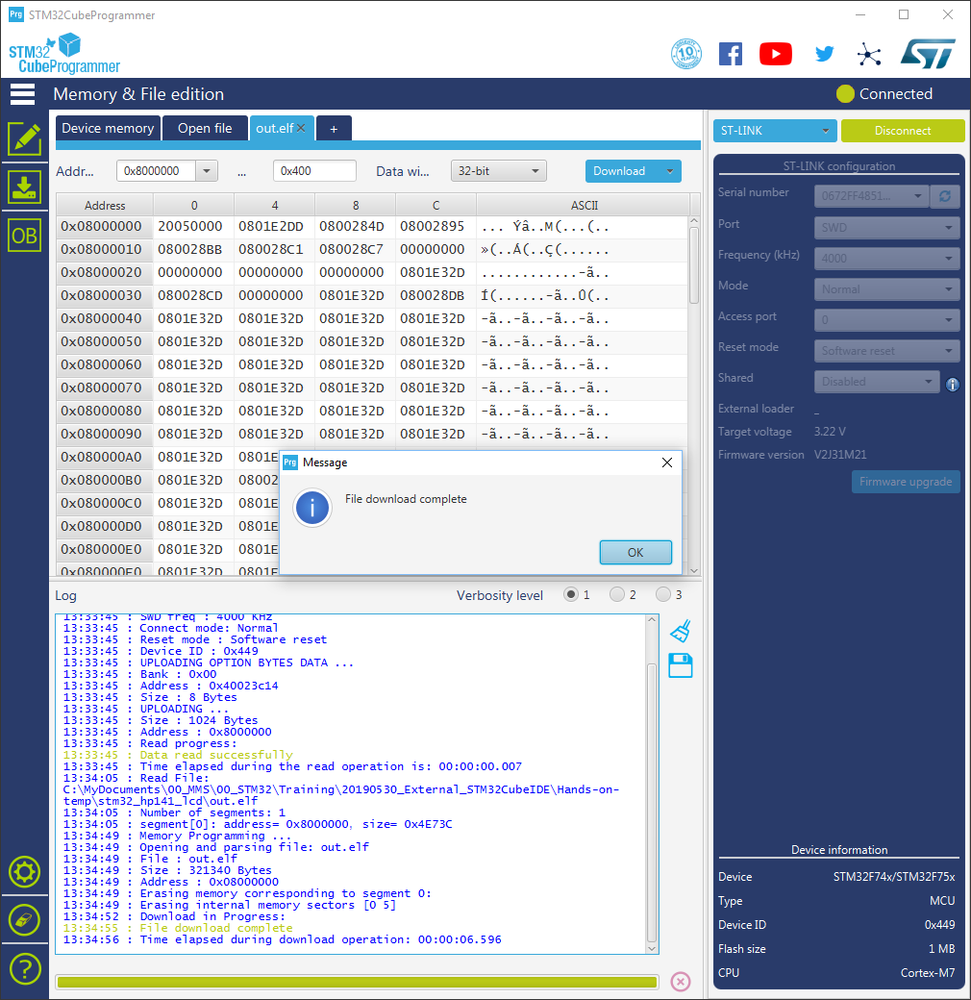

After programming out.elf, your board should have the following result:

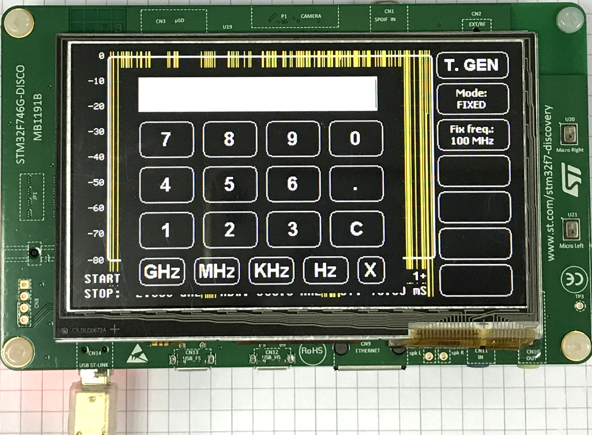

Now, let's see how to use STM32CubeIDE to build and debug such Makefile-base project.

## Steps

1. Start a new STM32 project
   
   * Select "Help -->Information Center":
     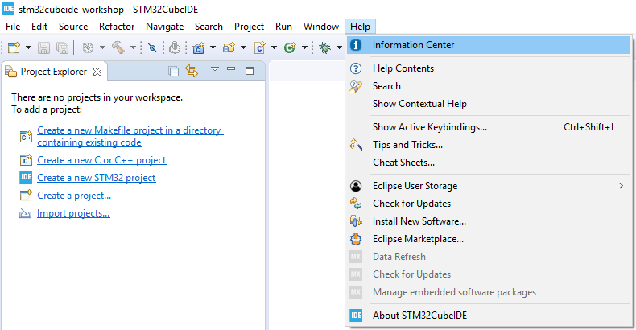
   
     
   
   * Press "Start new STM32 project":
     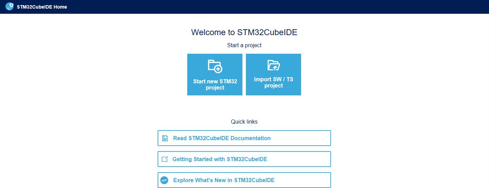
   * Select "32F746DISCOVERY" board from "Board Selector" and press "Next" button:
     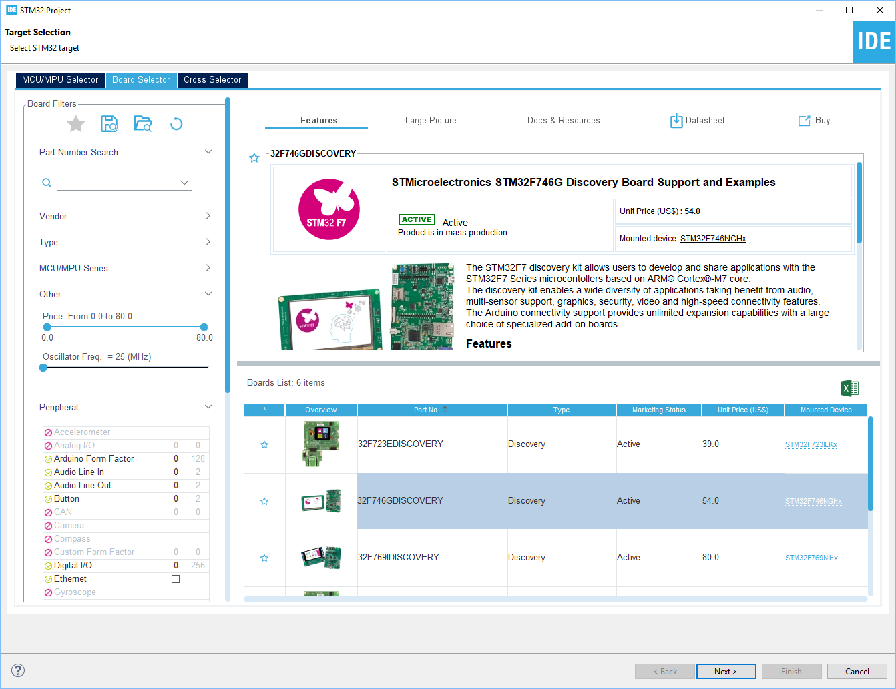
   * Assign "Project Name" and "Location", and make sure "Targeted Project Type" is "Empty". Press "Finish" button when all is set.
     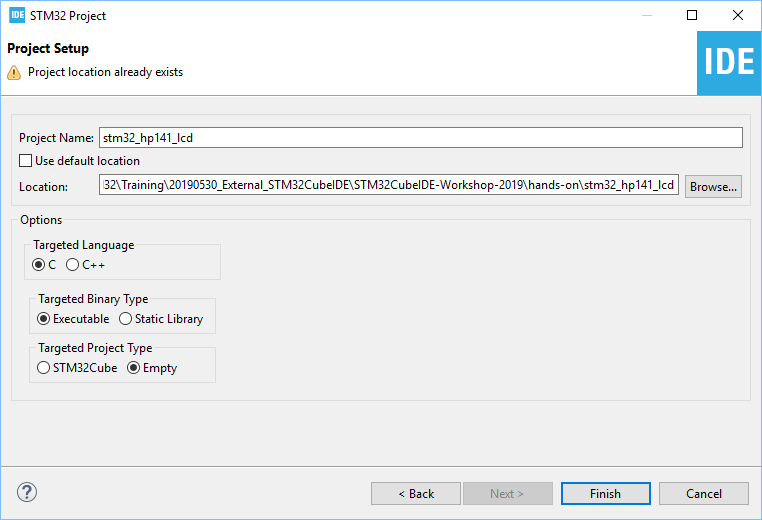
   
5. Prepare for compiling   
   * Delete all folders and files:
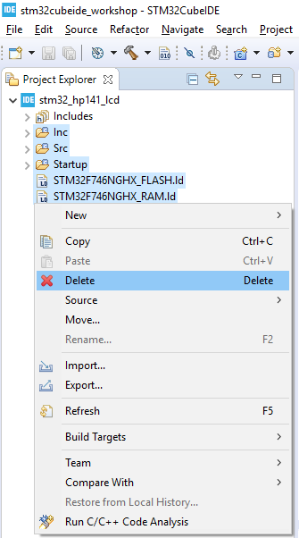
   * Drag all "stm32_hp141_lcd" file (except out.elf) and folders into "stm32_hp141_lcd" in Project Exploere of STM32CubeIDE:
     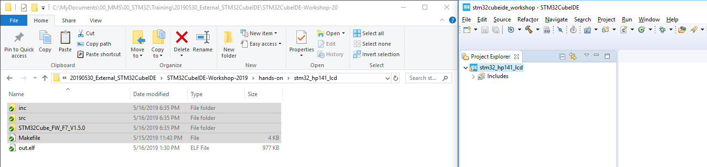
   * Select "Copy files and folders" and then press "OK":
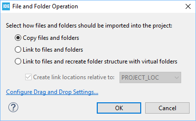
   
8. Compile the code
   
   * Select "Properties":
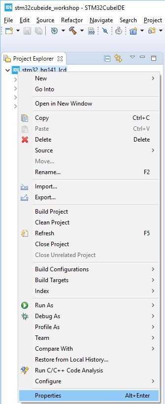
   
   * Modify "Builder Settings" (uncheck "Generate Makefiles automatically" and delete string "Debug" in Build directory) as shown below :
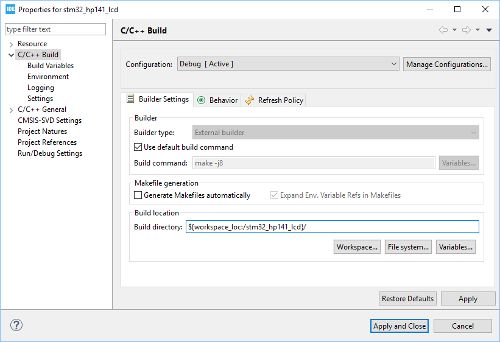
     
   * Select "Build Project":
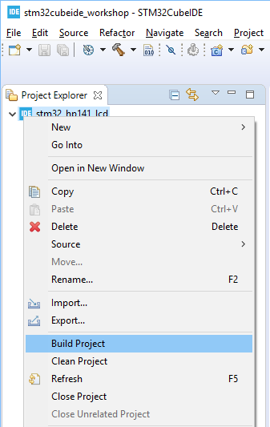
     
     

11. Start debug

    * Select "Debug As --> STM32 MCU C/C++ Application"
    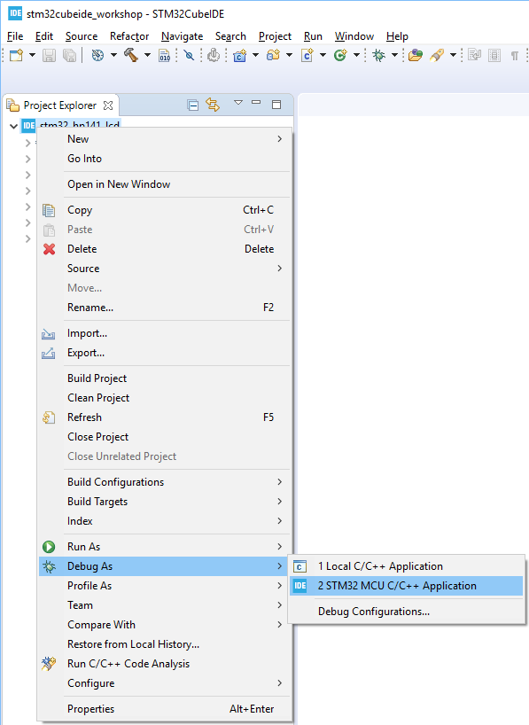
    * Press "OK" button in "Edit Configuration":
    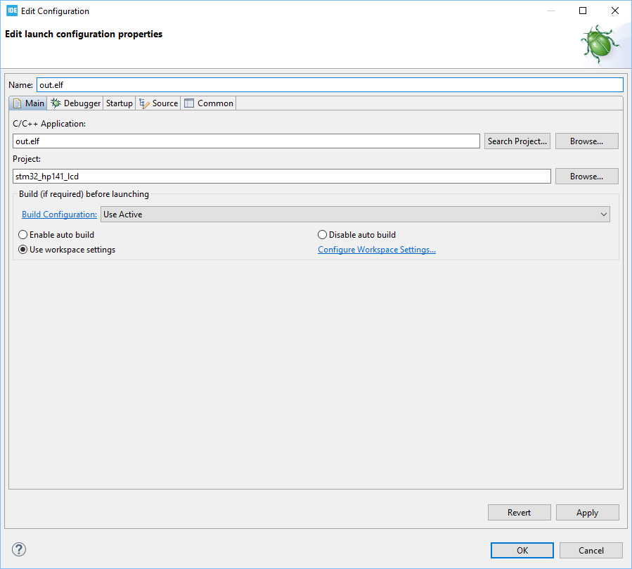
    * Press "Resume" button to run the code:
    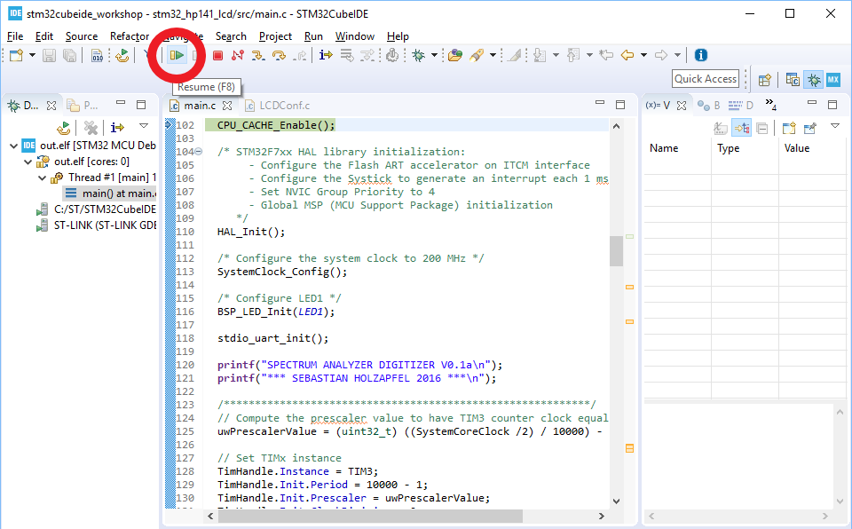

