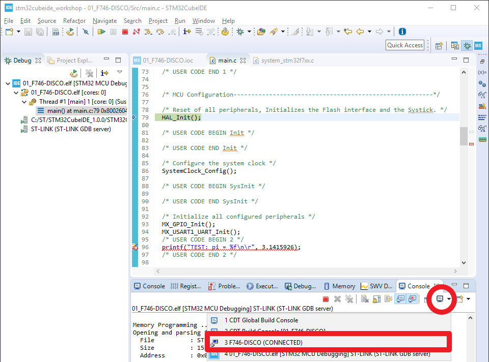
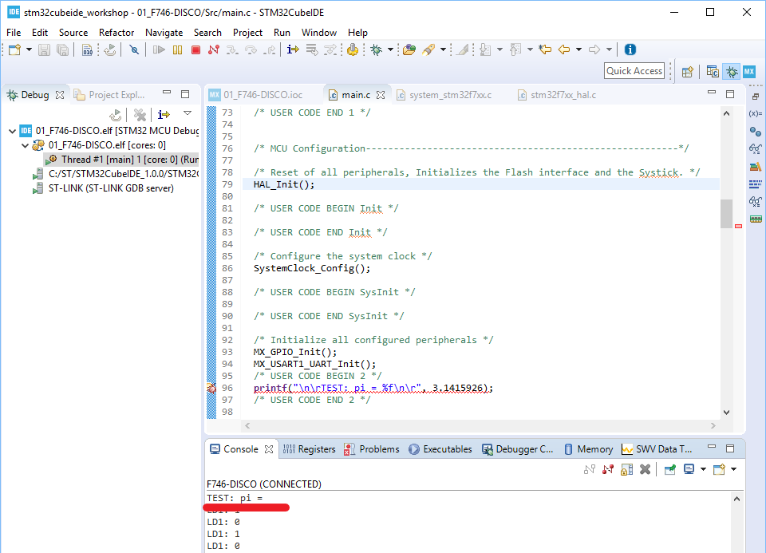
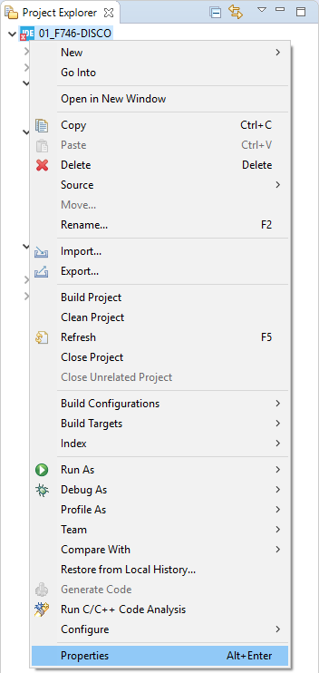
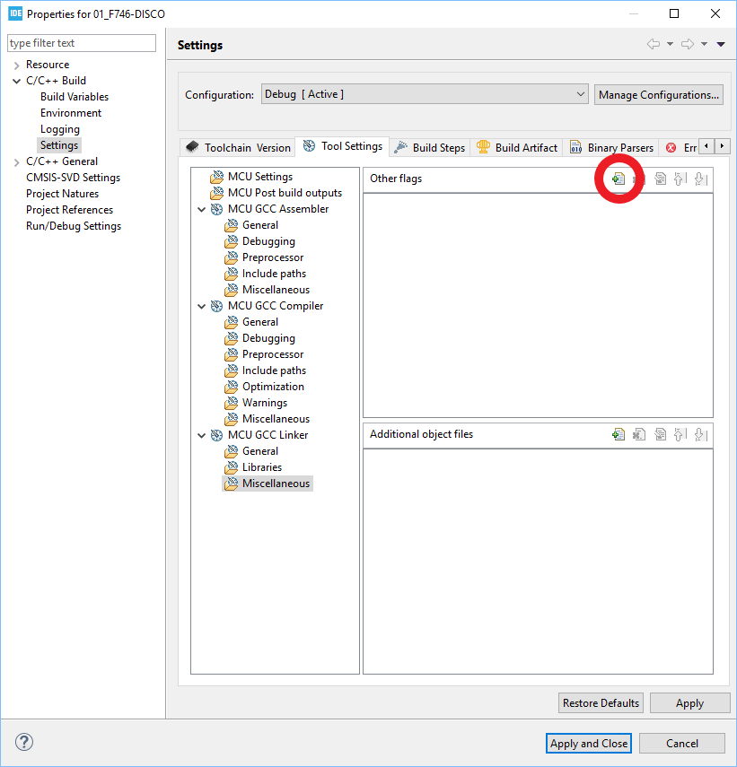
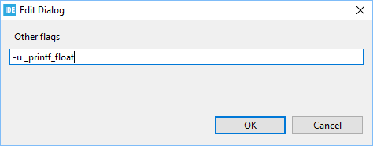
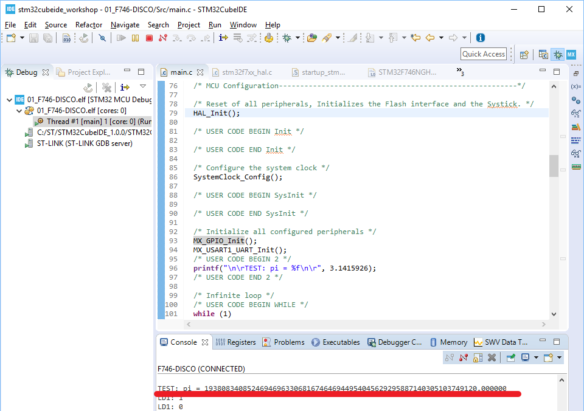

# Hands-on: printf over Virtual COMport (UART1) for Floating Number

1. On top of the previous hands-on of printf, let's add the following code into USER CODE Block 2 to print out message containing floating number:
   
   ```c
     /* USER CODE BEGIN 2 */
     printf("TEST: pi = %f\n\r", 3.1415926);
     /* USER CODE END 2 */
   ```
   
   
   
2. "Build Project" --> "Debug As --> 2 STM32 C/C++ Application" to enter Debug Perspective. 
   
   * Open UART console as shown below:
     
   * Here is the result after pressing "Resume" button. As you can see, the floating number is not printed out as expected.
     
   


3. Go back to the code added in step 1, there is a warning bug icon in front of the code and tells us to enable linker flag -u _printf_float:

   
   
   
   
4. Enable linker flag -u _printf_float

   * Right click on project folder and select "Properties":
   
   * Go to "MCU GCC Linker --> Miscellaneous" to enable the flag:
   
   * Type "-u _printf_float" in the dialog and then press "OK":
   
   * After setting the flag, the warning disappears.

   

5. Let's run "Build Project" --> "Debug As --> 2 STM32 C/C++ Application" to run the code again and you will see the result is a bit better (at least a floating number is printed out) but still wrong while in the meantime LD1 toggling is working well.
   
   
   
   
6. Open "STM32F746NGHX_FLASH.ld" in project folder and change _estack from 0x2004ffff to 0x20050000. 

   

7. Let's run "Build Project" --> "Debug As --> 2 STM32 C/C++ Application" to run the code again and finally get the expected result:
   


Note: this issue has been widely discussed in ST Community:

- <https://community.st.com/s/question/0D50X0000AldaPzSQI/cubeide-sprintf-does-not-work-with-f>
- https://community.st.com/s/question/0D50X0000AnrcyjSQA/how-to-use-float-in-printf

