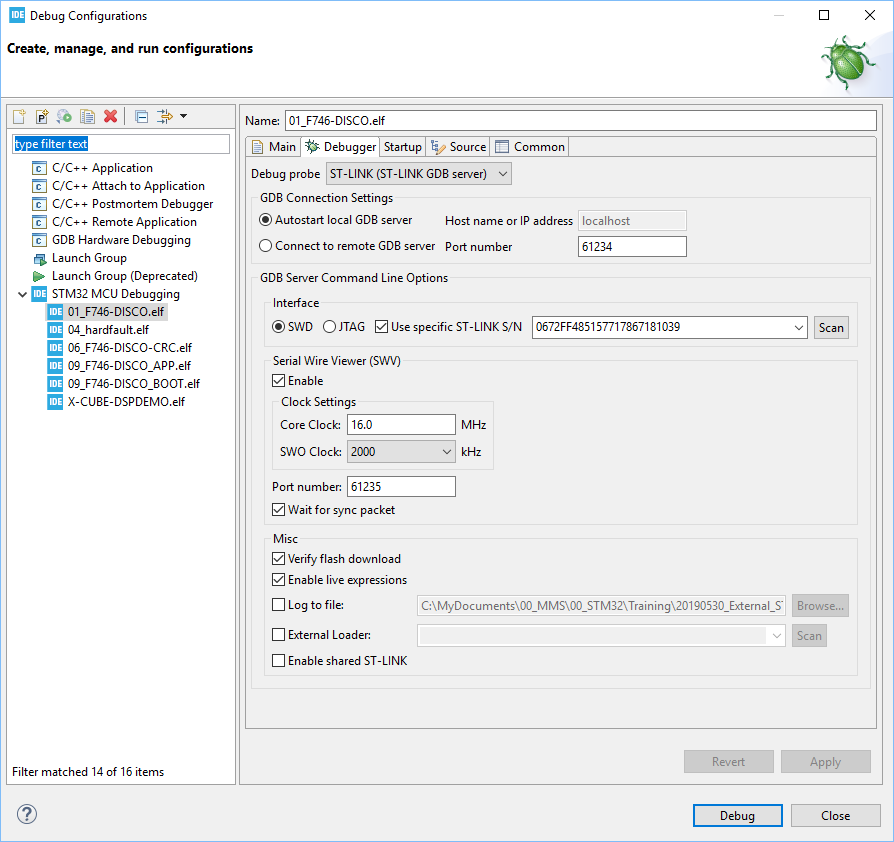
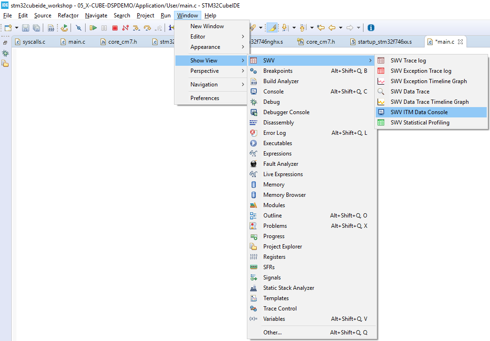
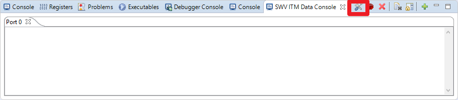
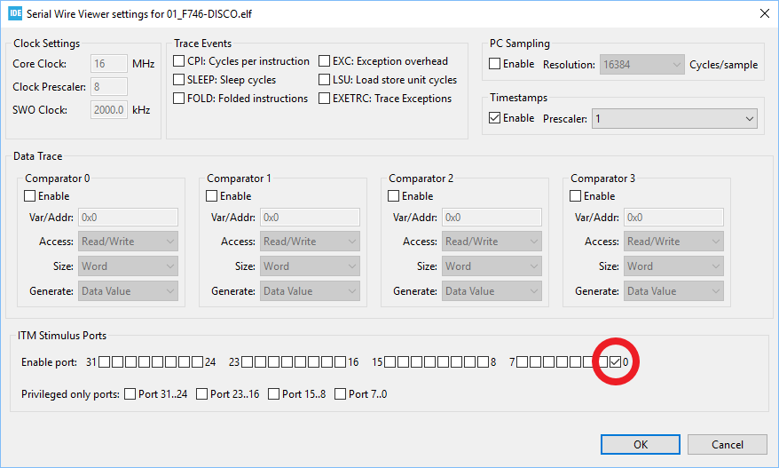
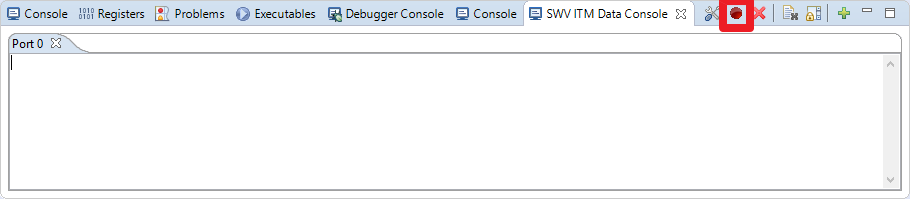
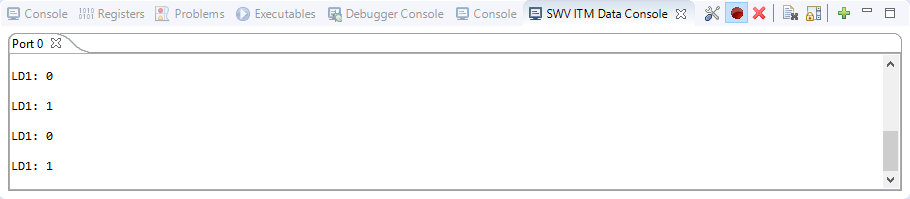

# Hands-on: printf over SWO

1. Modify the following code in USER CODE Block 4:
   
   ```c
   /* USER CODE BEGIN 4 */
   #ifdef __GNUC__
   #define PUTCHAR_PROTOTYPE int __io_putchar(int ch)
   #else
     #define PUTCHAR_PROTOTYPE int fputc(int ch, FILE *f)
   #endif /* __GNUC__ */
   {
     //HAL_UART_Transmit(&huart1, (uint8_t *)&ch, 1, 0xFFFF);
     ITM_SendChar((uint32_t)ch);
     return ch;
   }
   /* USER CODE END 4 */
   ```
   
   
   
2. Enable SWV as shown below and then press "Debug" button to start debug session:  
             
   
   * Check "Enable" in SWV portion.
   * Set Core Clock 16MHz
   
   
   
2. Before pressing "RESUME" button, please enable SWV ITM Data Console as shown below:  

   
   
   
4. Configure SWV ITM Data Console:

   * Press "Configure trace" button as shown below:  
     
   * Enable ITM Stimulus Port 0 as shown below and then press "OK" button:  
     
   
   
   
5. Press "Start trace" button: 
   
   
   
   
6. After pressing "RESUME" button, message will be printed in SWV ITM Data Console as shown below:

   

