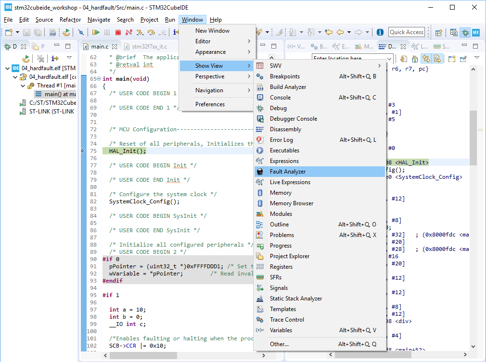
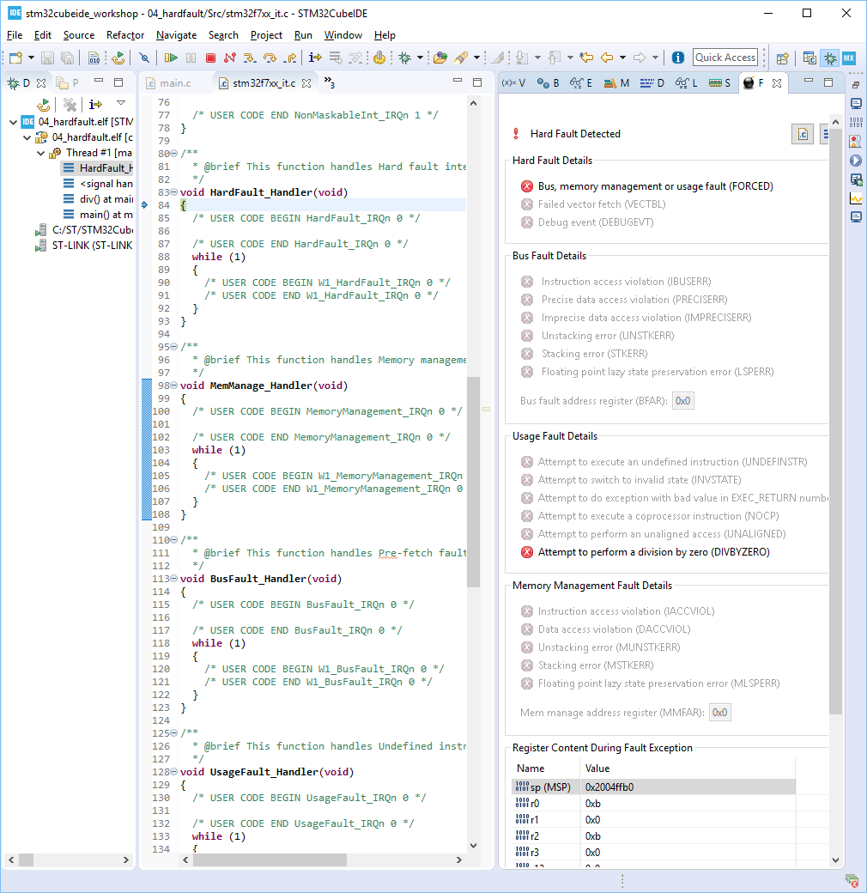

# Hands-on: HardFault Analyzer

1. Add the following code on top of hands-on #3:
   
   * USER CODE Block PFP:
   
     ```c
     /* USER CODE BEGIN PFP */
     int div(int , int );
     /* USER CODE END PFP */
     ```
   
   * USER CODE Block 2:
   
     ```c
       /* USER CODE BEGIN 2 */
       int a = 10;
       int b = 0;
       __IO int c;
      
       /*Enables faulting or halting when the processor executes an SDIV or UDIV instruction with a divisor of 0*/
       SCB->CCR |= 0x10;
      
       a++;
       
       c = div(a,b);
       /* USER CODE END 2 */
     ```
   
   * USER CODE Block 4:
     
     ```c
     /* USER CODE BEGIN 4 */
     int div(int lho, int rho)
     {
       return lho/rho;
     }
     /* USER CODE END 4 */
     ```
    
     
   


2. "Build Project" and run debug session. Before pressing "Resume" button, open "**Fault Analyzer**" by selecting "Window --> Show View --> Fault Analyzer":
   
   
   
   
3. Press "Resume" button in Debug Perspective and then code stops: with "Fault Analyzer" popping up:
    

  


