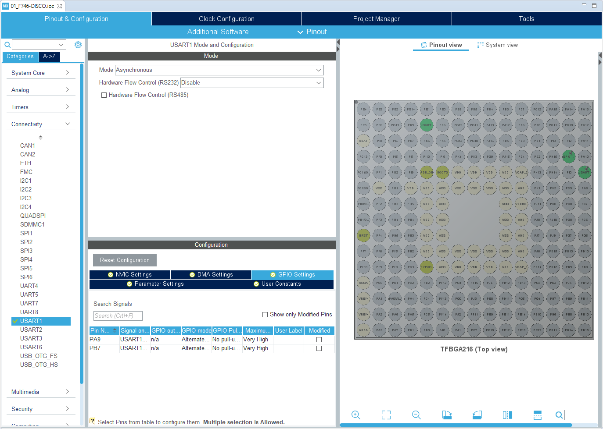
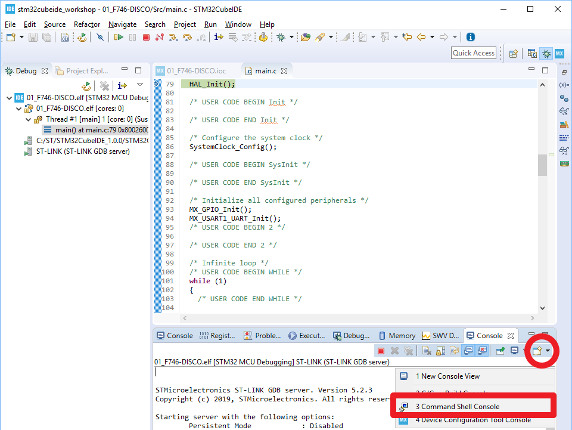
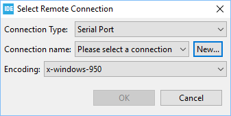
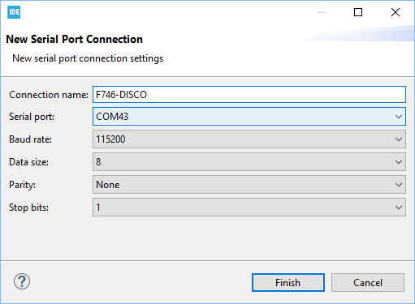
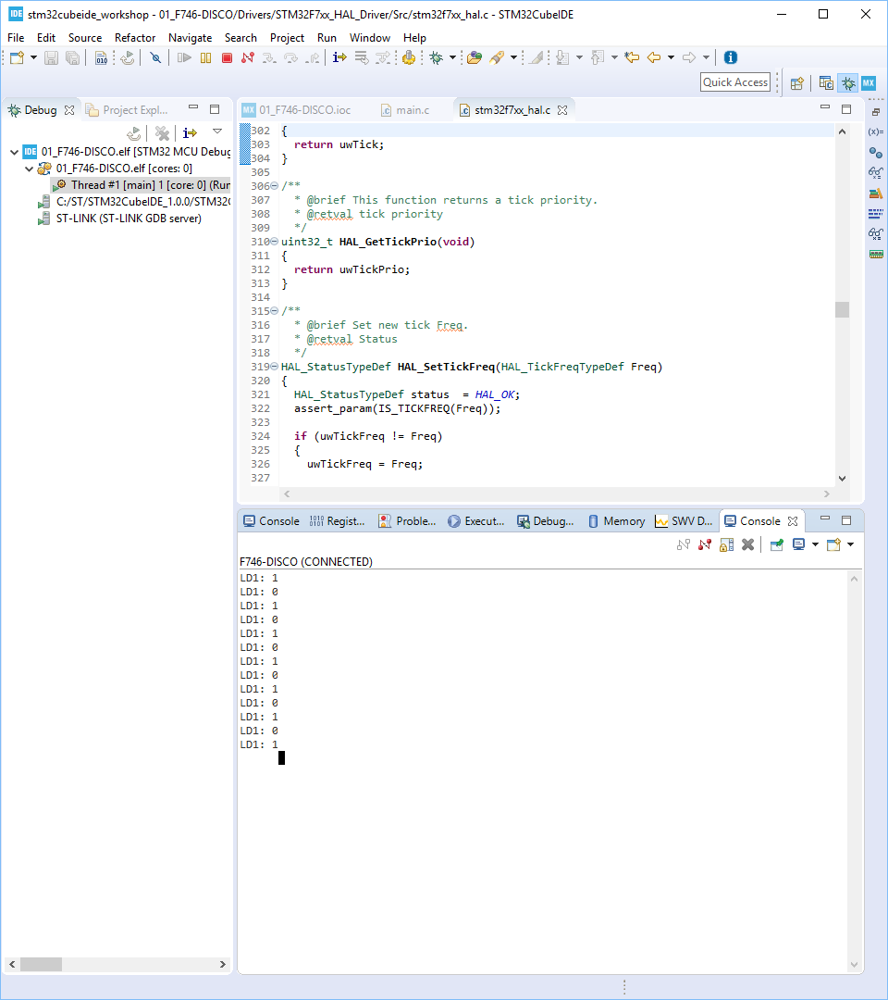

# Hands-on: printf over Virtual COMport (UART1)

1. Add UART1 support on top of hands-on #1
   
   
   
   
2. Add the following code:

   * Inside USER CODE Block 3:
     
     ```c
         /* USER CODE BEGIN 3 */
         HAL_Delay(500);
       HAL_GPIO_TogglePin(GPIOI, GPIO_PIN_1);
         printf("LD1: %d\n\r", HAL_GPIO_ReadPin(GPIOI, GPIO_PIN_1));
     }
       /* USER CODE END 3 */
     ```
     
     
     
   * Inside USER CODE Block 4:

     ```c
     /* USER CODE BEGIN 4 */
     int __io_putchar(int ch)
   {
       HAL_UART_Transmit(&huart1, (uint8_t *)&ch, 1, 0xFFFF);
       return ch;
     }
     /* USER CODE END 4 */
     ```
     
     
     
   * Inside USER CODE Block Includes

     ```c
     /* USER CODE BEGIN Includes */
     #include <stdio.h>
     /* USER CODE END Includes */
     ```

     

3. "Build Project" --> "Debug As --> 2 STM32 C/C++ Application" to enter Debug Perspective.

4. Before pressing "Resume" button to run your code, let's activate STM32CubeIDE UART console

   * Select "Command Shell Console" as shown below:
     
   * Set "Serial Port" in Connection Type and then press "New" button:
     
   * Assign proper "Connection name" and "Serial port" and then press "Finish" button as shown below:
     
   


5. Press "Resume" button in Debug Perspective and message will be printed in the console:

   
   
   
6. Let's move on to the [next topic still regarding printf](printf_float_number.md).
   
   


