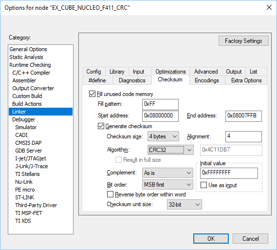
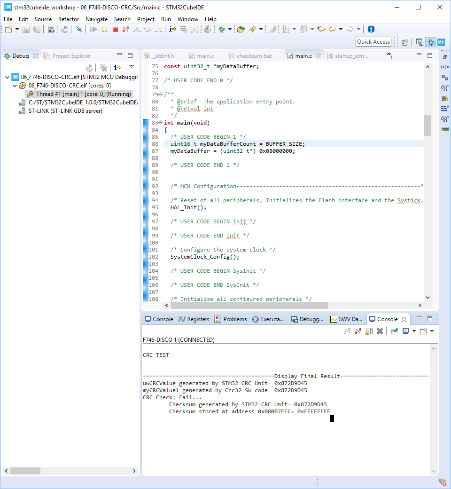
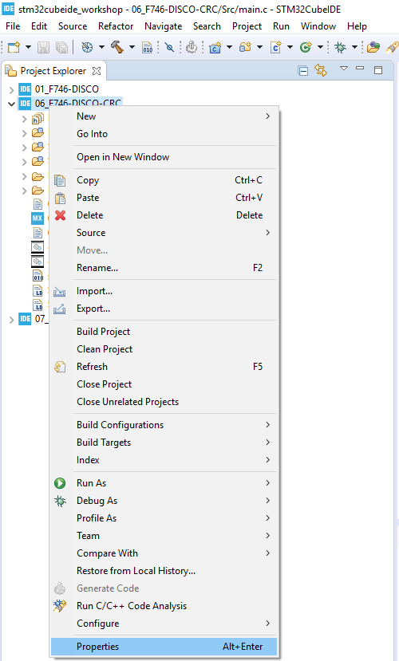
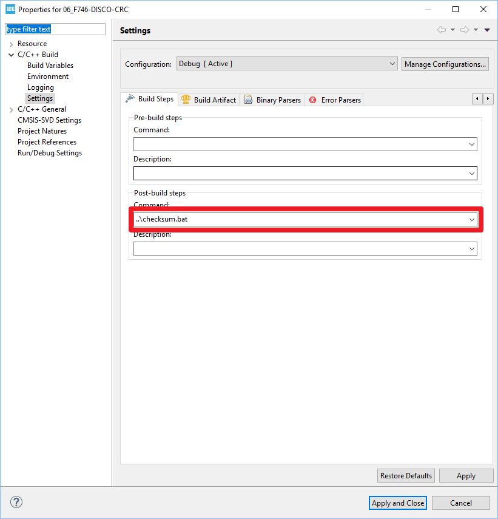
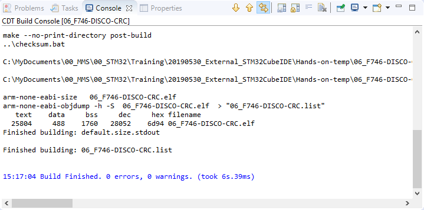
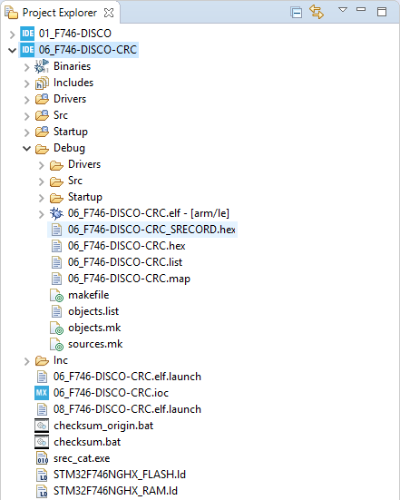
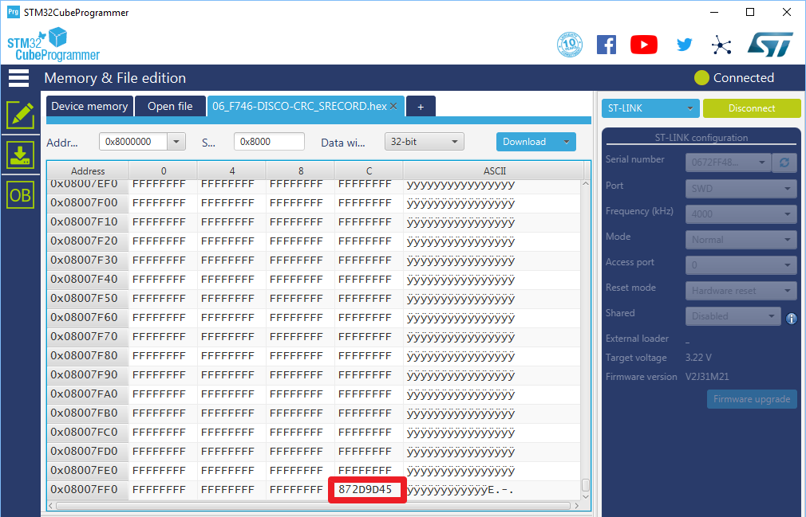
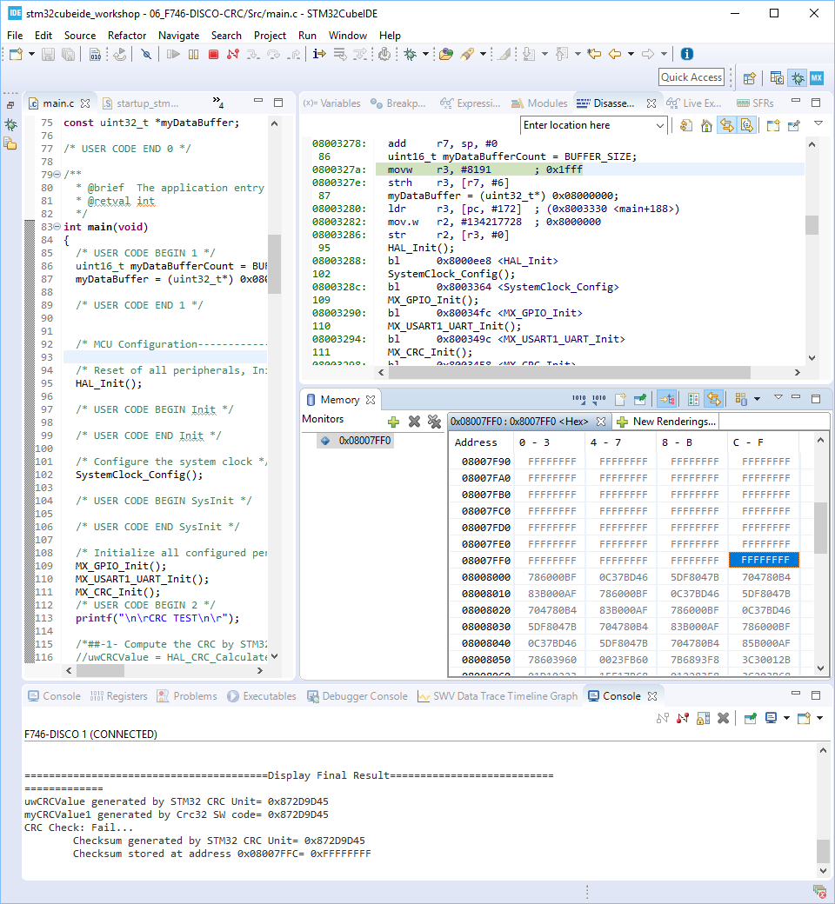
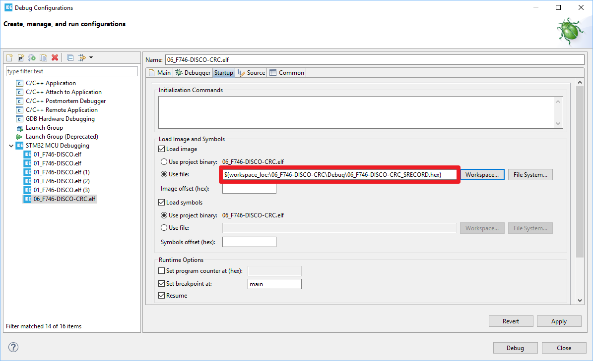
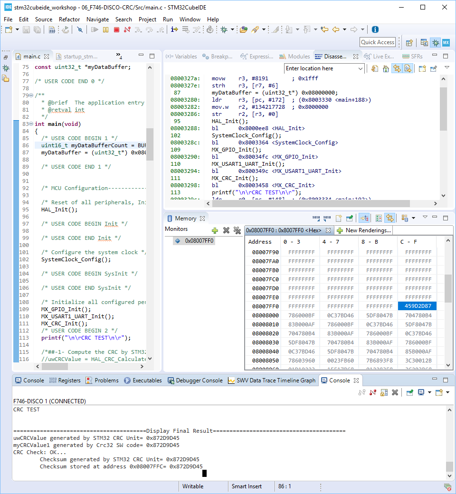

# Hands-on: CRC Checksum Generation

### Introduction

IAR EWARM provides a way to generate checksum as shown below:

How can this be done by using STM32CubeIDE? This hands-on provides an option for you. 

### Steps

1. Import the reference project.

2. Build Project

3. Start Debug session and check result from serial port console as shown below:  
   
   
   * CRC generated by CRC unit in STM32F746 is 0x872D0D45.
   * CRC generated by CRC code running over STM32F746 is also 0x872D0D45.
   * Checksum stored in the last word of the first sector is 0xFFFFFFFF which is not aligned with that generated by CRC unit and therefore CRC check fails. This is expected since we have not put any checksum into the HEX/BIN file yet.
   
   
   
4. [Srec_cat](http://srecord.sourceforge.net/download.html) could be used to generate CRC checksum and put it into HEX file. To simplify the process, please put srec_cat.exe into the root of project folder.

    
   
5. Right click on project icon and then select "Properties":  
   

    
   
6. Type "..\checksum.bat" in Command of Post-build steps:  
   

    
   
7. "Clean Project" and then "Build Project" again and we can see checksum.bat executes correctly without error:  
   

    
   
8. Check files under "Debug" folder and **06_F746-DISCO-CRC_SRECORD.hex** generated by checksum.bat is found:  
   

    
   
9. Check the last word of 06_F746-DISCO-CRC_SRECORD.hex by STM32CubeProgrammer. CRC checksum generated by srec_cat and put in the last word of **06_F746-DISCO-CRC_SRECORD.hex** (0x872D9D45) is exactly the same as that by CRC unit of STM32F746 (0x872D9D45).  
   

    
   
10. After running the debug session and checking the result in serial port console, we still get CRC check failure. And memory address 0x08007FFC which is supposed to have CRC checksum 0x872D9D45 still contains 0xFFFFFFFF:  
    

    
    
11. The reason of this failure is due to the fact that **06_F746-DISCO-CRC_SRECORD.hex** (containing CRC checksum) is not programmed when running debug session. We need to assign 06_F746-DISCO-CRC_SRECORD.hex** (containing CRC checksum) to be programmed instead of original **06_F746-DISCO-CRC.elf** (w/o CRC checksum). Please open "Debug Configuration" and make the following change:   

    

    
    
12. Run debug session again and finally get correct expected result:   

    

    

    

