# Hands-on: ISR in ICTM

### Introduction

* According to Reference Manual of STM746, we can put execution code into ITCM RAM (16MB):  
   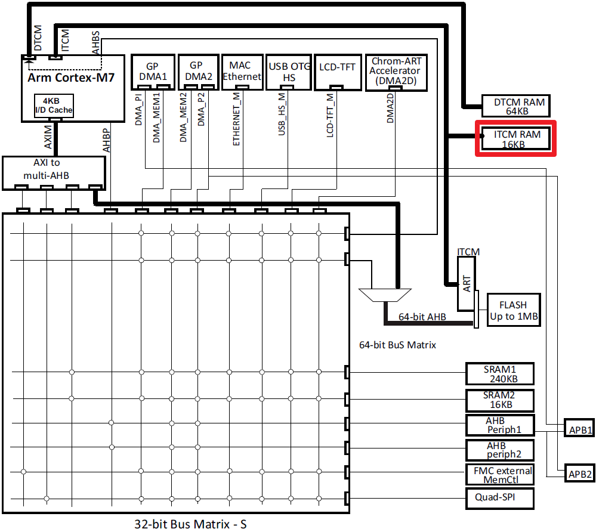

* The following cases will be covered in this hands-on by three different "**Build Configurations**":
   1. Single ISR in ITCM
   
   2. Single ISR along with vector table in ITCM

   3. All ISRs in stm32f7xx_it along with vector table in ITCM
   
      
   
### Case 1: Single ISR (SysTick_Handler) in ITCM

1. Add new build configuration for case 1:

   * Right click on project icon and then select "Build Configurations --> Manage":  
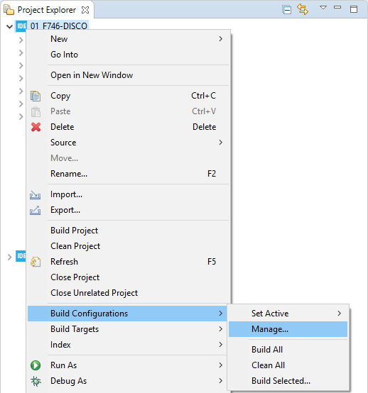
   
   
   
   * Press "New..." button:  
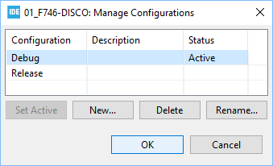
     
     
     
   * Type in "case 1" in Name and then press "OK" button:  
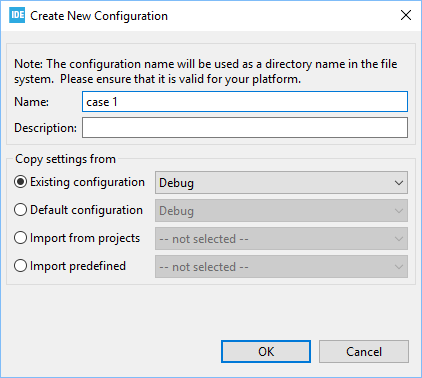
     
     
     
   * Select case 1 and then press "Set Active" button:  
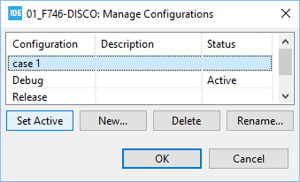
     
     
     
   * Press "OK" button to finish setting up new build configuration:  
     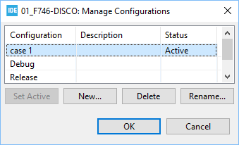
     
     
   
2. Manage **stm32f7xx_it.c**
   
   * Rename the original **stm32f7xx_it.c** to **stm32f7xx_it_case1.c** 
   
   * Add \_\_attribute\_\_((section())) in front of SysTick_Handler(void) in **stm32f7xx_it_case1.c** as shown below:    
   
     ```c
     __attribute__((section(".itcmram"))) void SysTick_Handler(void)
     {
       ...
     }
     ```

   
   
3. Manage **startup_stm32f746nghx.s**

   * Copy reference **startup_stm32f746nghx_case1.s** and paste it to Startup folder in Project Explorer 
   * Exclude original **startup_stm32f746nghx.s**:

      * Right clock on startup_stm32f746nghx.s and then select "Properties":  
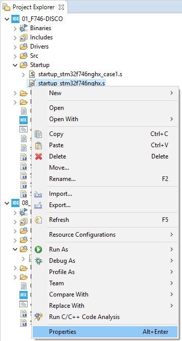
      * Check "Exclude resource from build" as shown below:  
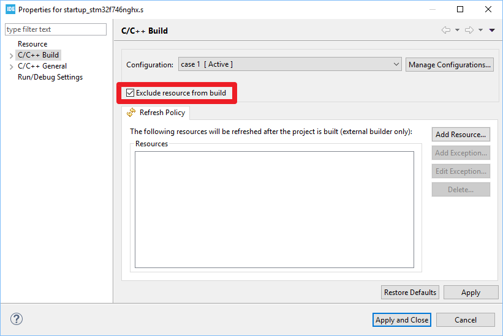
   
   
   
4. Manage **system_stm32f7xx.c**:   

   - Copy **system_stm32f7xx.c** and paste it in Project Explorer and then rename it to **system_stm32f7xx_case1.c**
   
5. Manage **STM32F746NGHX_FLASH.ld**:  

   * Rename STM32F746NGHX_FLASH.ld in Project Explorer to **STM32F746NGHX_FLASH_case1.ld**. 

   * Add the following section .itcmram definition into linker script **STM32F746NGHX_FLASH_case1.ld** between .data and .fini_array sections:

     ```c
          .itcmram :
          {
            . = ALIGN(4);
            _sitcmram = .;       /* create a global symbol at ccmram start */
            *(.itcmram)
       
            . = ALIGN(4);
            _eitcmram = .;       /* create a global symbol at ccmram end */
          } >ITCMRAM AT> FLASH
     ```

   - Setup linker:

     - Right click on project icon and then select "Properties":   
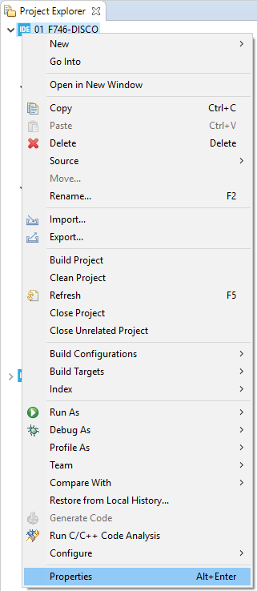

     - Set correct name of linker script and then press "Apply and Close" button as shown below:  
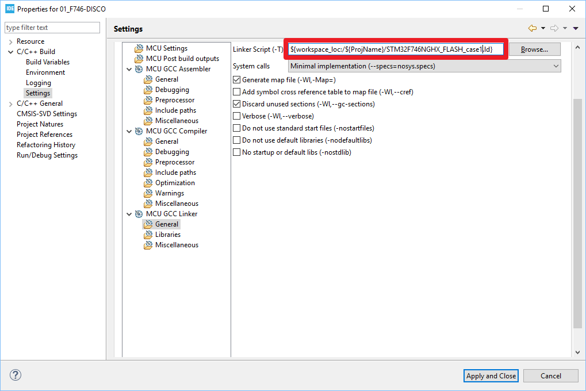
   
   
   
6. Before building the project, please check again the following files are correctly placed in your Project Explorer: 

   - Src\stm32f7xx_it_case1.c
   - Src\system_stm32f7xx_case1.c
   - Startup\startup_stm32f746nghx_case1.s
   - STM32F746NGHX_FLASH_case1.ld
   
   
   
7. After building project, SysTick_Handler is in section .itcmram which is located in ITCMRAM memory region by checking Build Analyzer as shown below:  
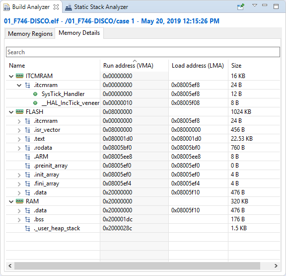
   
   
   
8. After starting debug session, set a breakpoint in SysTick_Handler() and then press "RESUME" button and then code stops at the breakpoint:  
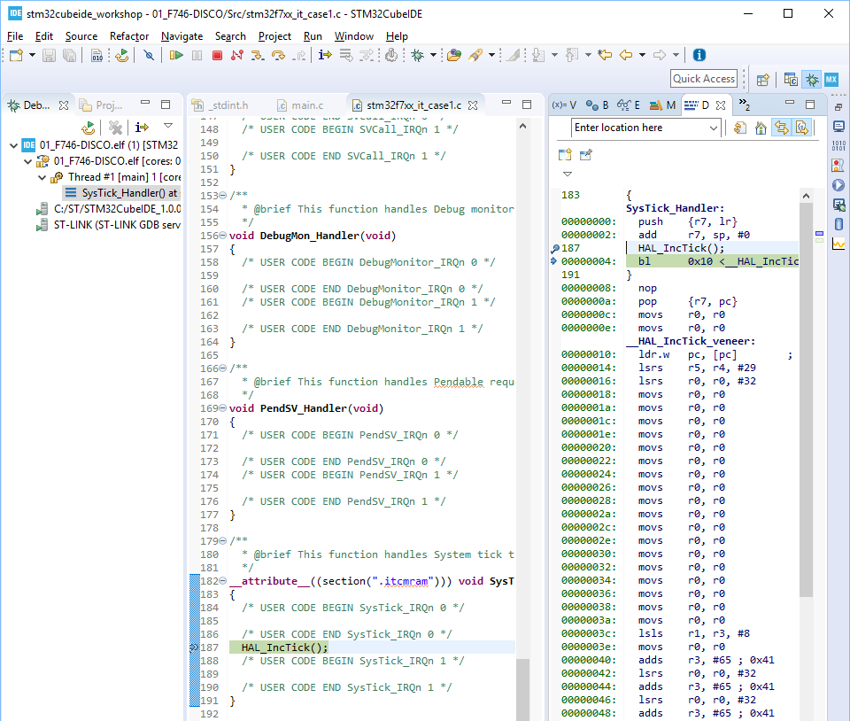

  


### Case 2: Single ISR (SysTick_Handler) along with vector table in ITCM
1. Please follow case 1 to add new build configuration for case 2.

   

2. Manage **stm32f7xx_it.c**

   * Copy **stm32f7xx_it_case1.c** under Src folder in Project Explorer, paste it in the same folder and then rename it to **stm32f7xx_it_case2.c**

   * Exclude **stm32f7xx_it_case1.c**.

   

3. Manage **startup_stm32f746nghx.s**

   * Copy reference **startup_stm32f746nghx_case2.s** and paste it to Startup folder in Project Explorer.

   * Exclude original **startup_stm32f746nghx_case1.s**.

   

4. Manage system_stm32f7xx.c

   - Copy **system_stm32f7xx_case1.c** and paste it in Project Explorer and then rename it to **system_stm32f7xx_case2.c**

   - Exclude **system_stm32f7xx_case1.c**.

   - Change VTOR setting:

     ```c
     SCB->VTOR = 0x00000000;
     ```

     

5. Manage **STM32F746NGHX_FLASH.ld**: 

   * Copy and paste **STM32F746NGHX_FLASH_case1.ld** in Project Explorer and rename the copied file to **STM32F746NGHX_FLASH_case2.ld**. 

   * Add the following section .itcmram definition into linker script **STM32F746NGHX_FLASH_case2.ld** between .data and .fini_array sections:

     ```c
          .itcmram :
          {
            . = ALIGN(4);
            _sitcmram = .;       /* create a global symbol at ccmram start */
            *(.isr_vector_itcm)
            *(.itcmram)
       
            KEEP(*(.isr_vector_itcm .itcmram))
         
            . = ALIGN(4);
            _eitcmram = .;       /* create a global symbol at ccmram end */
          } >ITCMRAM AT> FLASH
     ```

   - Setup linker:

     - Right click on project icon and then select "Properties":   
   

     - Set correct name of linker script and then press "Apply and Close" button as shown below:  
   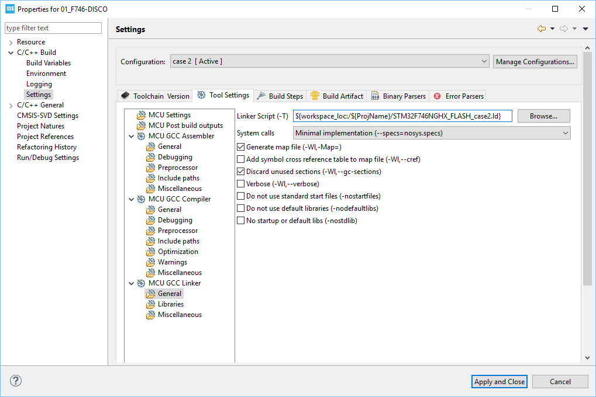

   

6. Before building the project, please check again the following files are correctly placed in your Project Explorer: 

   - Src\stm32f7xx_it_case2.c
   - Src\system_stm32f7xx_case2.c
   - Startup\startup_stm32f746nghx_case2.s
   - STM32F746NGHX_FLASH_case2.ld

   

7. After building project, SysTick_Handler and 2nd vector table (g_pfnVectors_itcm) are placed in section .itcmram which is located in ITCMRAM memory region by checking Build Analyzer as shown below:  
    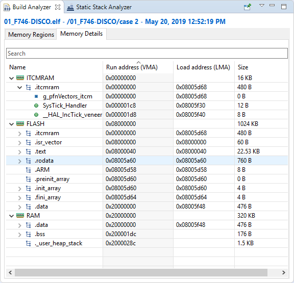

  

8. After starting debug session, set a breakpoint in SysTick_Handler() and then press "RESUME" button and then code stops at the breakpoint:  
    

  * SysTick_Handler is executed without error.
  * From "Memo View", 2nd vector table is placed correctly.
### Case 3: All ISRs in stm32f7xx_it along with vector table in ITCM
1. Please follow case 1 and 2 to add new build configuration for case 3.

   

2. Manage **stm32f7xx_it.c**

   - Copy **stm32f7xx_it_case2.c** under Src folder in Project Explorer, paste it in the same folder and then rename it to **stm32f7xx_it_case3.c**

   - Exclude **stm32f7xx_it_case2.c**.

   - Remove _\_attribute\_\_((section())) in front of SysTick_Handler(): 

     ```CQL
     void SysTick_Handler(void)
     {
       ...
     }
     ```

     

3. Manage **startup_stm32f746nghx.s**

   - Copy reference **startup_stm32f746nghx_case3.s** and paste it to Startup folder in Project Explorer.
   - Exclude **startup_stm32f746nghx_case2.s**.

   

4. Manage system_stm32f7xx.c

   - Copy **system_stm32f7xx_case2.c** and paste it in Project Explorer and then rename it to **system_stm32f7xx_case3.c**

   - Exclude **system_stm32f7xx_case2.c**.
     
     

5. Manage **STM32F746NGHX_FLASH.ld**: 

   - Copy and paste **STM32F746NGHX_FLASH_case2.ld** in Project Explorer and rename the copied file to **STM32F746NGHX_FLASH_case3.ld**. 

   - Add the following section .itcmram definition into linker script **STM32F746NGHX_FLASH_case3.ld** between .data and .fini_array sections:

     - .text section:
     
       ```CQL
       .text :
         {
           . = ALIGN(4);
           /**(.text)     */      /* .text sections (code) */
           /**(.text*)    */      /* .text* sections (code) */
           
           *(EXCLUDE_FILE (*stm32f7xx_it_config3.o) .text)           
           *(EXCLUDE_FILE (*stm32f7xx_it_config3.o) .text*)           
           
           *(.glue_7)         /* glue arm to thumb code */
           *(.glue_7t)        /* glue thumb to arm code */
           *(.eh_frame)
       
           KEEP (*(.init))
           KEEP (*(.fini))
       
           . = ALIGN(4);
           _etext = .;        /* define a global symbols at end of code */
         } >FLASH
       ```
       
       
       
     - .itcmram section:
     
       ```c
         .itcmram :
         {
           . = ALIGN(4);
           _sitcmram = .;       /* create a global symbol at ccmram start */
           *(.isr_vector_itcm)
           *stm32f7xx_it_case3.o (.text .text*)
           *(.itcmram)
       
           KEEP(*(.isr_vector_itcm .itcmram))
        
           . = ALIGN(4);
           _eitcmram = .;       /* create a global symbol at ccmram end */
         } >ITCMRAM AT> FLASH
       ```
       
       


   - Setup linker:
     - Right click on project icon and then select "Properties":  

     - Set correct name of linker script and then press "Apply and Close" button as shown below:  


   

6. Before building the project, please check again the following files are correctly placed in your Project Explorer: 

   - Src\stm32f7xx_it_case3.c
   - Src\system_stm32f7xx_case3.c
   - Startup\startup_stm32f746nghx_case3.s
   - STM32F746NGHX_FLASH_case3.ld

   

7. After building project, all interrupt handlers and 2nd vector table (g_pfnVectors_itcm) are placed in section .itcmram which is located in ITCMRAM memory region by checking Build Analyzer as shown below:  
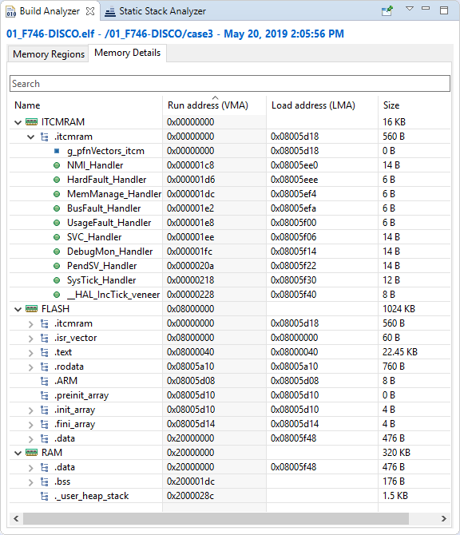

   

8. After starting debug session, set a breakpoint in SysTick_Handler() and then press "RESUME" button and then code stops at the breakpoint:  
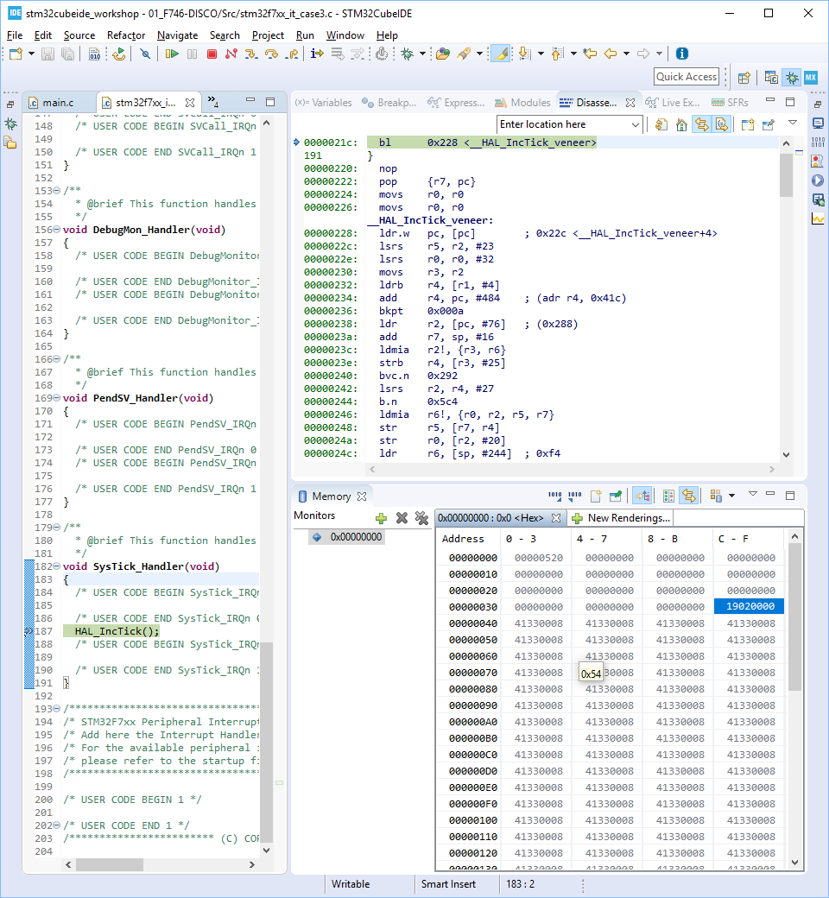
   
   * _\_attribute\_\_((section())) is not used for all interrupt handlers.
   * SysTick_Handler() is executed correctly.
   * From "Memo View", 2nd vector table is placed in ICTM correctly.
