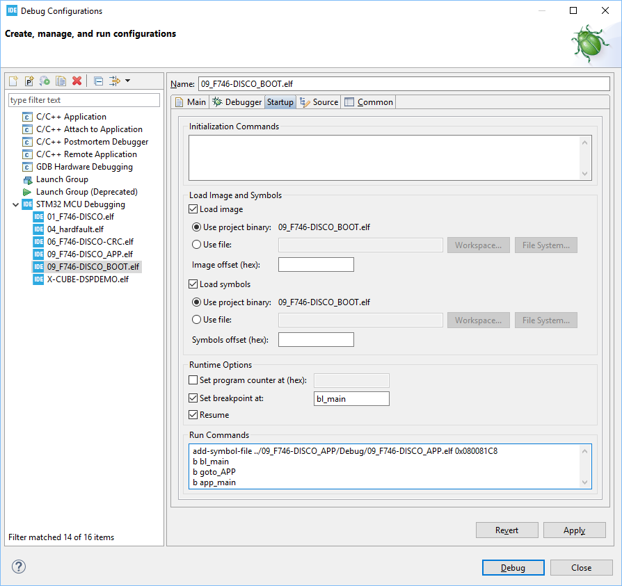
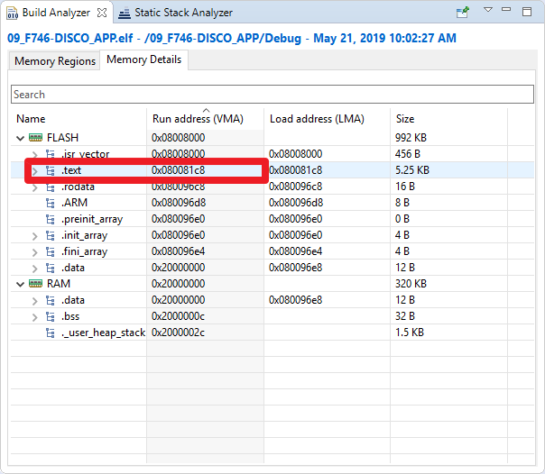
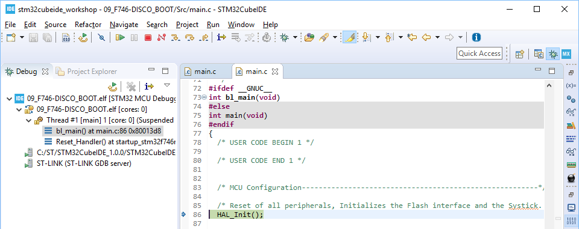
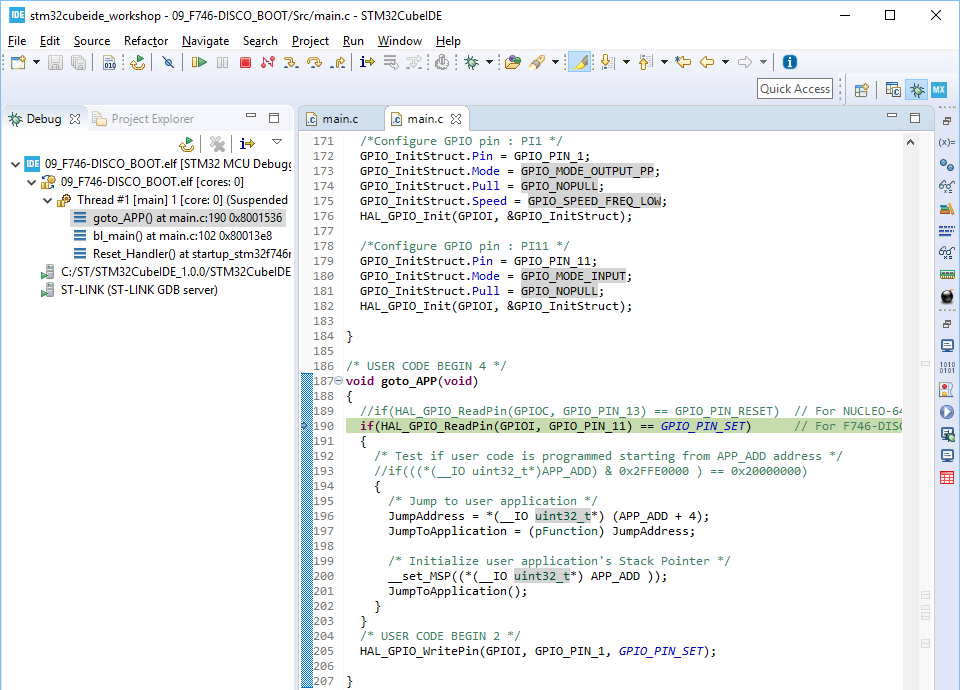
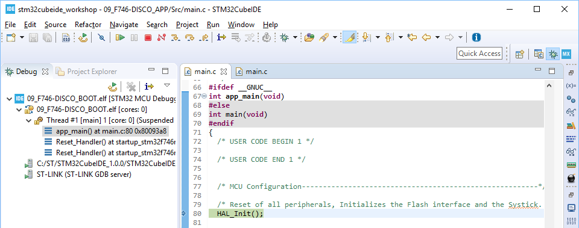
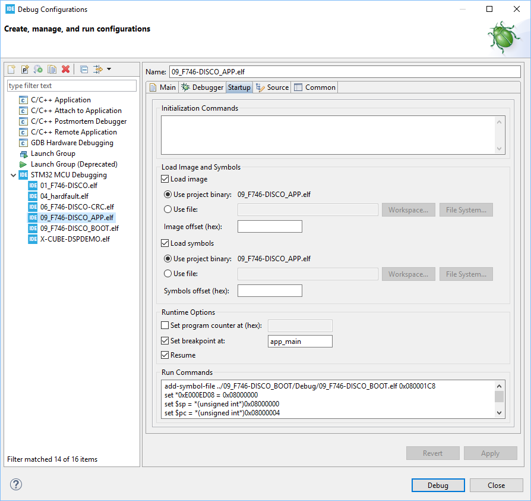
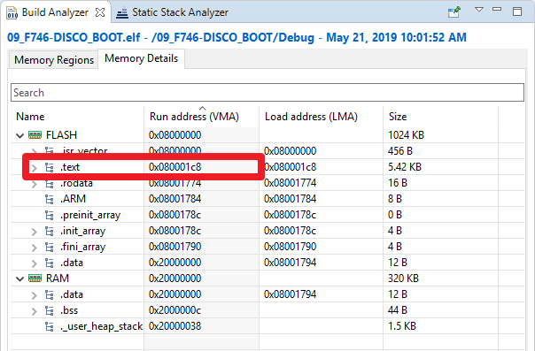
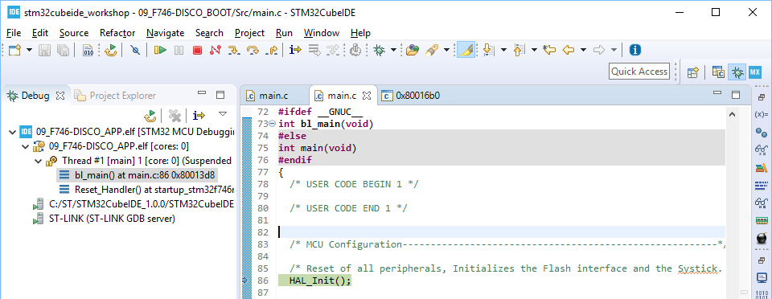
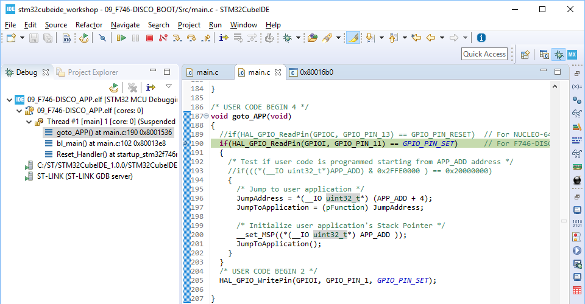
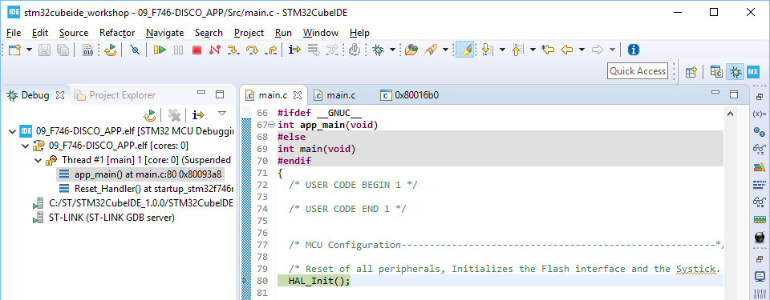

# Hands-on: Debug for BOOT+APP

## Introduction

Debug between two ELFs is also a common topic of IDE. Assuming you have the following ELFs:

- **BOOT.elf** (starting from 0x08000000): jumps to a certain location in which stores the address of Reset_Handler of APP.elf when button is pressed. When user button is not press, it runs LED toggling every 1s.
- **APP.elf** (starting from 0x08008000): simply runs LED toggling every 100ms. 

The purpose of this hands-on is to demonstrate how to debug between BOOT.elf and APP.elf.


## Steps (Prepare APP.elf and BOOT.elf)

1. Make APP.elf
   
   1. Start a new STM32 project of STM32F746-DISCO or modify the previous hands-on (such as 1st or 3rd) with the following code into **main.c**:
   
      * Change main to app_main:
   
        ```c
        int app_main(void)
        {
          ...
        }
        ```
   
        **Warning**:  This change will be reverted back to main after pressing "Generate code".
   
      * USER CODE Block 3:
   
        ```c
             /* USER CODE BEGIN 3 */
              HAL_Delay(100);
              HAL_GPIO_TogglePin(GPIOI, GPIO_PIN_1);
            }
            /* USER CODE END 3 */
        ```
   
        
   
   2. Change main to app_main in **startup_stm32f746nghx.s**:
   
      ```c
        ...
        bl __libc_init_array
        bl  app_main
        bx  lr 
        ...
      ```
   
      
   
   3. Modify FLASH memory region in linker script **STM32F746NGHX_FLASH.ld**:
   
      ```c
      MEMORY
      {
          FLASH (rx)	: ORIGIN = 0x8008000,	LENGTH = 992K
          RAM	(rwx)	: ORIGIN = 0x20000000,	LENGTH = 320K
      }
      ```
   
      
   
   4. Modify "Vector Table Offset" in **system_stm32f7xx.c**:
   
      ```c
      #define VECT_TAB_OFFSET  0x8000
      ```
   
      
   
   5. "Build Project", run debug session and you will see LED toggles every 100ms.
      
   
2. Make BOOT.elf

   1. Start a new STM32 project of STM32F746-DISCO with the following codes in **main.c**

      * Change main to bl_main:

        ```c
        int bl_main(void)
        {
          ...
        }
        ```

        **Warning**:  This change will be reverted back to main after pressing "Generate code".

      * Into USER CODE Block 0:

        ```c
        /* USER CODE BEGIN 0 */
        typedef  void (*pFunction)(void);
        void goto_APP(void);
        pFunction JumpToApplication;
        uint32_t JumpAddress;
        
        #define APP_ADD     0x08008000
        /* USER CODE END 0 */
        ```

      * Into USER CODE Block 2 (inside main()):

        ```c
          /* USER CODE BEGIN 2 */
          goto_APP();
          /* USER CODE END 2 */
        ```

      * Into USER CODE Block 3 (inside main()):

        ```c
            /* USER CODE BEGIN 3 */
            HAL_Delay(1000);
        	HAL_GPIO_TogglePin(GPIOI, GPIO_PIN_1);
          }
          /* USER CODE END 3 */
        ```

      * Into USER CODE Block 4:

        ```c
        /* USER CODE BEGIN 4 */
        void goto_APP(void)
        {
          if(HAL_GPIO_ReadPin(GPIOI, GPIO_PIN_11) == GPIO_PIN_SET)	// For F746-DISCO
          {
            /* Test if user code is programmed starting from APP_ADD address */
            //if(((*(__IO uint32_t*)APP_ADD) & 0x2FFE0000 ) == 0x20000000)
            {
              /* Jump to user application */
              JumpAddress = *(__IO uint32_t*) (APP_ADD + 4);
              JumpToApplication = (pFunction) JumpAddress;
        
              /* Initialize user application's Stack Pointer */
              __set_MSP((*(__IO uint32_t*) APP_ADD ));
              JumpToApplication();
            }
          }
          HAL_GPIO_WritePin(GPIOI, GPIO_PIN_1, GPIO_PIN_SET);
        }
        /* USER CODE END 4 */
        ```

        

   2. Change main to bl_main in **startup_stm32f746nghx.s**:

      ```c
        ...
        bl __libc_init_array
        bl  bl_main
        bx  lr 
        ...
      ```

      

   3. "Build Project", run debug session. 

      * Press "RESUME" button in CubeIDE, you will see LED toggles every 1s.
      * Press "RESET" button in CubeIDE to restart the debug again.
      * Press blue user button of the board before pressing "RESUME" button in CubeIDE:
      * After pressing "RESUME" button in CubeIDE, you will see LED toggles every 100ms which means APP.elf starts to run.

      

   

## Steps (Running Debug Session of BOOT.elf with Breakpoints in APP.elf)


1. Open "Debug Configuration" of BOOT.elf and add the following scripts into "Run Commands" in Startup tab:

   ```c
   add-symbol-file ../09_F746-DISCO_APP/Debug/09_F746-DISCO_APP.elf 0x080081C8
   b bl_main
   b goto_APP
   b app_main
   ```

   

   

   **NOTE1**: the path of APP.elf used by add-symbol-file command needs to be modified based on the path used in your project.

   **NOTE2**: the offset (0x080081C8) used by add-symbol-file command is the beginning address of section .text of APP. This value could be obtained by checking Build Analyzer as shown below:
   

   

2. Press "Debug" button to start the debug session. 

   1. Debug stops at the first breakpoint bl_main:
      
   2. Press "RESUME" button and then debug stops at the first breakpoint goto_APP:
      
   3. Press blue user button of the board, press "RESUME" button and then debug stops at the 3rd breakpoint app_main:
      

   


## Steps (Running Debug Session of APP.elf with Breakpoints in BOOT.elf)

1. Open "Debug Configuration" of APP.elf and add the following scripts into "Run Commands" in Startup tab:

   ```c
   add-symbol-file ../09_F746-DISCO_BOOT/Debug/09_F746-DISCO_BOOT.elf 0x080001C8
       
   set *0xE000ED08 = 0x08000000
   set $sp = *(unsigned int*)0x08000000 
   set $pc = *(unsigned int*)0x08000004
   
   b bl_main
   b goto_APP
   b app_main
   ```

   

   

   **NOTE1**: the path of BOOT.elf used by add-symbol-file command needs to be modified based on the path used in your project.

   **NOTE2**: the offset (0x080001C8) used by add-symbol-file command is the beginning address of section .text of BOOT. This value could be obtained by checking Build Analyzer as shown below:
   
   **NOTE3**: PC/SP/VTOR need to be set by gdb commands to make debug start from BOOT.elf.

   

2. Press "Debug" button to start the debug session. 

   1. Debug stops at the first breakpoint bl_main:
      
   2. Press "RESUME" button and then debug stops at the first breakpoint goto_APP:
      
   3. Press blue user button of the board, press "RESUME" button and then debug stops at the 3rd breakpoint app_main:
      

   


