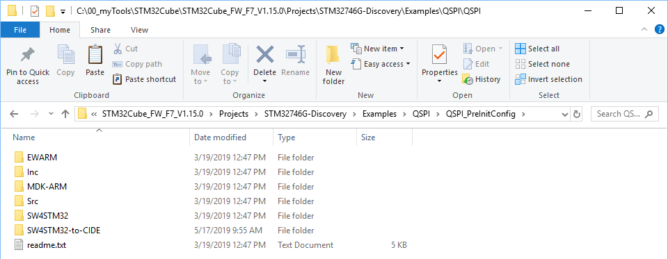
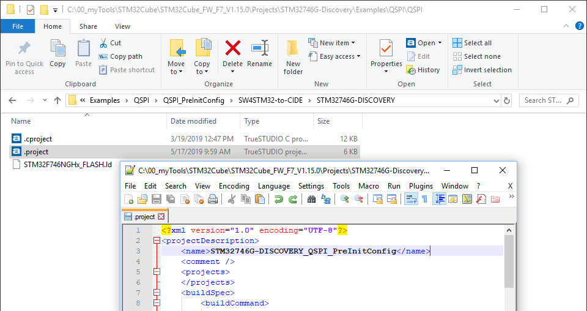
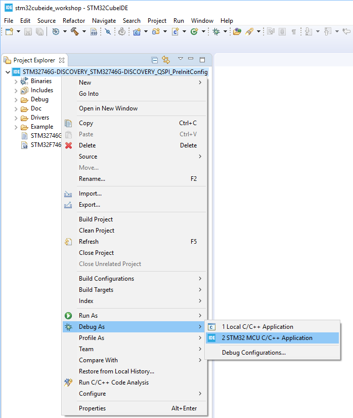
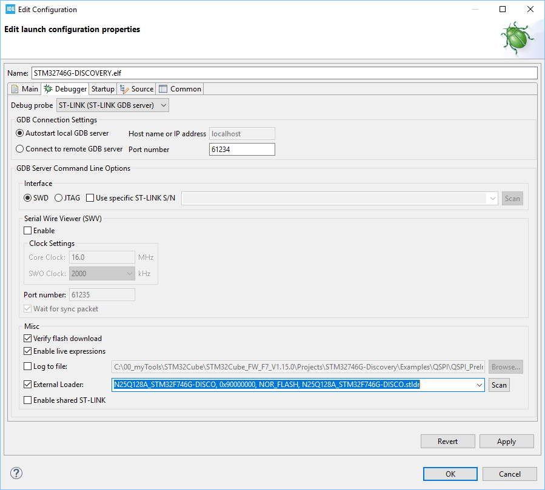
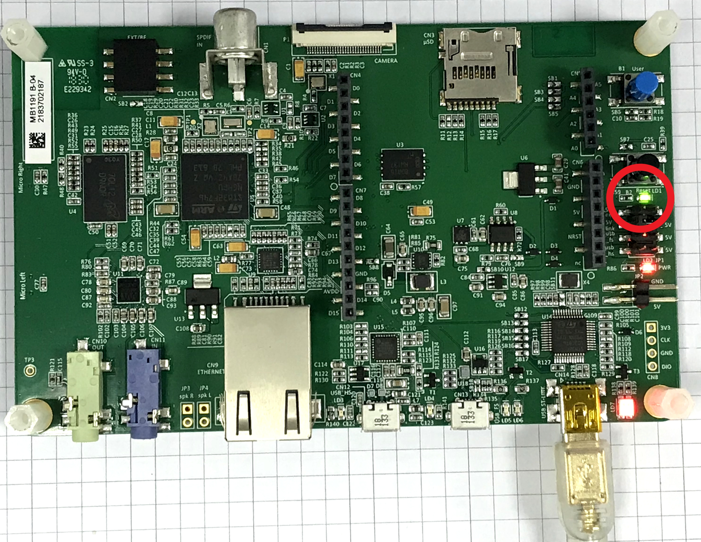
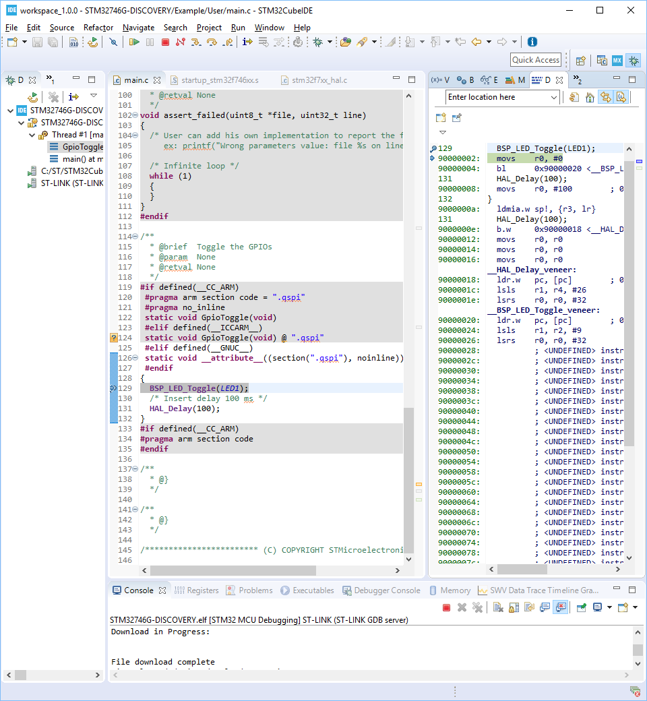

# Hands-on: QSPI_PreInitConfig

1. Import QSPI_PreInitConfig project inside STM32CubeF7 MCU firmware package as shown below:
   <u>STM32Cube_FW_F7_V1.15.0\Projects\STM32746G-Discovery\Examples\QSPI\QSPI_PreInitConfig</u>

   ###### Note: the location of <u>STM32Cube_FW_F7_V1.15.0</u> is where you download and unzip <u>en.STM32Cube_FW_F7_V1.15.0.zip</u> as requested in item 3 of [Prerequisite](../../README.md).

2. Suggest to copy SW4STM32 folder and rename it (such as SW4STM32-to-CIDE) as shown below:

   

3. Change the name from <u>STM32746G-DISCOVERY</u> to <u>STM32746G-DISCOVERY\_QSPI_PreInitConfig</u> in .project file:

   
   
4. Import the project and then build project.

5. Enter "Debug Configuration":

   

6. Enable and select external loader:

   

7. Press OK to run debug and watch LED blinking:

   
   
8. Set breakpoint at BSP_LED_Toggle inside GpioToggle() and watch the code really stops here where is located in QSPI:

   

